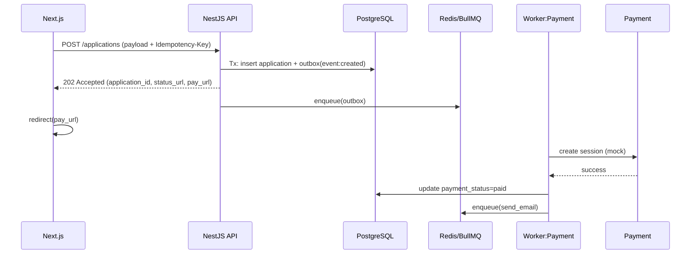

# PRD — University Admission Portal (Before/After Design Patterns)

> **Mục tiêu:** Xây dựng một website “Cổng nộp hồ sơ tuyển sinh trực tuyến” có thể **bật/tắt** các design pattern & thuộc tính chất lượng để **so sánh trước vs sau** (baseline vs improved). PRD này định nghĩa phạm vi, yêu cầu, luồng, kiến trúc, tiêu chí đo lường và kế hoạch rollout.

---

## 0. Tóm tắt điều hành (Executive Summary)
- **Bối cảnh:** Người dùng (thí sinh) nộp hồ sơ online, trả phí, theo dõi trạng thái duyệt. Giai đoạn sát deadline (23:59 ngày cuối cùng) lưu lượng tăng đột biến (burst), hệ thống baseline dễ nghẽn.
- **Định hướng cải tiến:** Áp dụng **Queue-Based Load Leveling** (bắt buộc) và các pattern: **Competing Consumers, Cache-Aside (Redis), Idempotency Key, Retry + Exponential Backoff + DLQ, Circuit Breaker, Bulkhead, Outbox, CQRS (mức nhẹ)**.
- **Kết quả kỳ vọng:**
  - API nộp hồ sơ phản hồi **202 Accepted** dưới 200ms ở p95 khi burst.
  - **Thông lượng** (jobs/min) tăng tuyến tính theo số worker.
  - Giảm **tỷ lệ lỗi** thanh toán & gửi email nhờ retry + DLQ.
  - **Trải nghiệm**: người dùng luôn thấy trạng thái rõ ràng (queued → processing → paid → verified).

---

## 1. Phạm vi & Mục tiêu sản phẩm
### 1.1 Phạm vi (đã thu hẹp)
- **Chỉ** 2 màn chính:
  1) **Thí sinh nộp hồ sơ**: đăng ký/đăng nhập, tạo hồ sơ, upload tài liệu, **nộp hồ sơ → chuyển trang thanh toán**, theo dõi trạng thái.
  2) **Admin so sánh Before/After**: bảng điều khiển bật/tắt **design patterns & thuộc tính chất lượng** (feature flags), xem số đo benchmark (latency, throughput, error, queue depth) **trước vs sau**.
- **Không** gồm màn phê duyệt/duyệt thủ công chi tiết; không cần vai trò Staff trung gian.

### 1.2 Mục tiêu đo lường (Measurable Goals)
- **p95 latency** `POST /applications` (submit): Before vs After như phần 12.
- **Throughput** xử lý hồ sơ: tăng theo số worker khi bật **Competing Consumers**.
- **Error rate** tác vụ chậm (payment/email): giảm ≥ 60% khi bật **Retry+DLQ**.
- **Cache hit rate** (Redis) ≥ 90% khi bật **Cache-Aside**.
- **Trang Admin** hiển thị biểu đồ so sánh **Before/After** theo thời gian.

### 1.3 Ngoài phạm vi (Out of Scope)
- Quy trình phê duyệt học thuật chi tiết; xét tuyển tự động.
- Tích hợp thanh toán thực (chỉ dùng sandbox/mock).

---

## 2. Persona & Hành trình người dùng
- **Thí sinh (Applicant):** nộp hồ sơ, upload file, thanh toán, theo dõi trạng thái.
- **Admin:** bật/tắt pattern (feature flags), cấu hình ưu tiên, số worker, quan sát số đo Before/After, thao tác DLQ/requeue cơ bản.

**User Journey rút gọn (Before → After)**
1) Submit hồ sơ → 2) Thanh toán → 3) Email xác nhận → 4) Theo dõi trạng thái.
- **Before (đồng bộ):** một request dài chạy toàn bộ → dễ timeout.
- **After (hàng đợi):** submit trả **202** + enqueue; các bước chậm chạy ở worker; UI theo dõi trạng thái realtime.

---

## 3. Yêu cầu tính năng (Functional Requirements)
### 3.1 Thí sinh
- Đăng ký/Đăng nhập.
- Tạo hồ sơ + Upload tài liệu (PDF/JPEG/PNG).
- **Nộp hồ sơ** → **chuyển ngay sang trang Thanh toán** (pay-now after submit).
- Theo dõi trạng thái hồ sơ (queued/processing/paid/verified/rejected) và nhận thông báo.

### 3.2 Admin (So sánh Before/After)
- **Feature Flags** bật/tắt theo nhóm:
  - Queue-Based Load Leveling (bắt buộc luôn ON trong chế độ After), Competing Consumers, Cache-Aside, Idempotency Key, Retry+Backoff+DLQ, Circuit Breaker, Bulkhead, Outbox, CQRS (nhẹ).
- **Cấu hình**: số worker theo pool, ngưỡng circuit breaker, thông số retry/backoff, mức ưu tiên.
- **Dashboard so sánh**: bảng & biểu đồ Before vs After cho latency p95, throughput jobs/min, error rate, queue depth, cache hit; chọn khoảng thời gian.
- **DLQ Console**: xem, requeue, purge cơ bản (demo).

### 3.3 API chính (rút gọn theo phạm vi mới)
- **Thí sinh**
  - `POST /applications` → 202 Accepted (id, status_url, pay_url)
  - `GET /applications/{id}` → trạng thái tiến trình
  - `POST /payments/checkout` (mock)
  - `POST /webhooks/payment` (mock)
- **Admin**
  - `GET /admin/flags` / `PATCH /admin/flags` → bật/tắt pattern
  - `GET /admin/metrics` → số đo để vẽ Before/After
  - `POST /admin/dlq/requeue` / `DELETE /admin/dlq/purge`

---

## 4. Yêu cầu phi chức năng (Quality Attributes)
- **Scalability/Burst Handling:** chịu được 3.000 RPS tại đỉnh; tăng worker tuyến tính.
- **Reliability/Resilience:** retry/backoff, DLQ, circuit breaker, bulkhead.
- **Performance:** p95 latency API “submit” ≤ 200ms dưới tải burst (nhờ 202 + enqueue).
- **Consistency:** Outbox đảm bảo publish-once; CQRS nhẹ tách đọc/ghi.
- **Observability:** logs có correlation-id, traces phân tán, metrics (RPS, p95, queue depth, success ratio, retries).
- **Security:** JWT auth, RBAC (applicant/staff/admin), scan virus file upload, rate limit/l7 throttle.
- **Compliance:** lưu dấu vết (audit), mã hoá at-rest/in-transit.

---

## 5. Baseline vs Improved — So sánh thiết kế
### 5.1 Kiến trúc tổng quan (Mermaid)
**Baseline (đồng bộ):**
```mermaid
flowchart LR
A[Applicant] --> B[Next.js]
B --> C[NestJS API]
C -->|Upload + Verify + Create Payment + Email (trong 1 request)| D[(PostgreSQL)]
C --> E[Payment (mock)]
C --> F[Mail]
```

**After (hàng đợi + flags):**
```mermaid
flowchart LR
A[Applicant] --> B[Next.js]
B -->|POST /applications| C[NestJS API]
C -->|Tx: App + Outbox| D[(PostgreSQL)]
C --> Q[Outbox Relay] --> R[(Redis/BullMQ)]
subgraph Workers (tùy số lượng qua flags)
W1[Verify]
W2[Payment]
W3[Email]
end
R --> W1
R --> W2 --> E[Payment (mock)]
R --> W3 --> F[Mail]
B -->|GET status| C
subgraph Admin
G[Admin UI]
end
G -->|PATCH flags| C
G -->|GET metrics| C
```

### 5.2 Bảng so sánh (Before vs After)
| Thuộc tính | Before | After |
|---|---|---|
| Latency submit | p95 > 3–10s khi burst | p95 ~ 100–200ms (202 Accepted) |
| Throughput | Bị ràng buộc bởi 1 tiến trình | Tăng tuyến tính theo worker |
| Error tạm thời | Cao | Retry+DLQ giảm mạnh |
| Quan sát | Thiếu số đo | Dashboard so sánh Before/After |

## 6. Design Patterns & Cấu hình Design Patterns & Cấu hình
### 6.1 Bắt buộc
- **Queue-Based Load Leveling (BullMQ/Redis)**
  - Hàng đợi cho các job: `verify_document`, `create_payment`, `send_email`.
  - **Response submit:** luôn **202 Accepted** + `application_id` + link theo dõi.

### 6.2 Tuỳ chọn (Feature Flags)
- **Competing Consumers:** `workers.verify = N`, `workers.payment = M`, `workers.email = K`.
- **Cache-Aside:** TTL 10 phút cho danh mục ngành, khung lệ phí, config kỳ tuyển sinh.
- **Idempotency Key:** header `Idempotency-Key` (UUID); lưu trong DB/Redis 24h.
- **Retry + Exponential Backoff:** `retries=5`, `base=2s`, `max=60s`; DLQ topic riêng.
- **Circuit Breaker (Payment):** open khi `error_rate > 20%` trong 60s hoặc `latency_p95 > 2s`.
- **Bulkhead Isolation:** pool riêng cho payment vs email; hạn mức đồng thời theo pool.
- **Outbox Pattern:** bảng `outbox` (id, aggregate_id, type, payload, status, created_at) + relay interval 200ms.
- **CQRS nhẹ:** bảng đọc `application_view` cập nhật bởi worker; API đọc chỉ truy vấn bảng view.

---

## 7. API & Luồng nghiệp vụ
### 7.1 Submit → Thanh toán ngay (Pay-Now After Submit)


### 7.2 Trạng thái hồ sơ
- `GET /applications/{id}` trả về: `status`, `progress` (%), `steps` (list), `last_updated`, `issues` (nếu có), `retry_count`.
- UI polling mỗi 1s (hoặc WebSocket / SSE khi có thời gian).

---

## 8. Mô hình dữ liệu (rút gọn)
- `applications(id, user_id, program_id, status, created_at, updated_at)`
- `application_files(id, application_id, url, checksum, size, virus_scanned, created_at)`
- `payments(id, application_id, amount, currency, status, provider_ref, created_at, updated_at)`
- `outbox(id, aggregate_id, type, payload_json, status, created_at)`
- **View:** `application_view(id, user_id, program, fee, status, paid, verified, updated_at)`

---

## 9. Quan trắc & Đo lường (Observability & Metrics)
- **Latency:** p50/p95/p99 cho `POST /applications`, `GET /applications/{id}`.
- **Queue depth:** tổng job/loại job, age max (P95 job age < 30s).
- **Throughput:** jobs/min theo worker-pool; success ratio.
- **Retries:** đếm, tỉ lệ thành công sau retry; DLQ size, thời gian lưu trung bình.
- **Cache:** hit/miss, warmup time.
- **Circuit breaker:** số lần open/half-open/close, thời lượng.
- **Billing (mock):** tỉ lệ thanh toán thành công, median time-to-paid.
- **UX:** thời gian hiển thị trạng thái ≤ 1s với 95% yêu cầu.

**Kế hoạch benchmark:**
- Kịch bản Locust/k6: spike 0 → 3.000 RPS trong 30s; duy trì 5 phút.
- Biến thiên worker: 3 → 30 (competing consumers), đo throughput & latency.
- Bật/tắt từng pattern để thấy ảnh hưởng riêng lẻ & cộng hưởng.

---

## 10. Bảo mật & Tuân thủ
- Auth: JWT (access + refresh); mật khẩu băm (Argon2/bcrypt).
- RBAC: applicant/staff/admin; hạn quyền API, 2FA cho admin.
- Upload: quét virus (clamav) async trước khi verify; hạn MIME/size.
- PII: mã hoá at-rest (disk/DB) & in-transit (TLS); masking trong log.
- Audit: ghi sự kiện truy cập/duyệt/sửa.

---

## 11. Tech Stack & Triển khai
- **Frontend:** Next.js 15 + shadcn; 2 khu vực chính: **Applicant Flow** & **Admin Flags/Dashboard**.
- **Backend:** NestJS (REST), BullMQ/Redis, PostgreSQL (docker), Prisma/TypeORM.
- **Observability:** OpenTelemetry, Prometheus/Grafana, Loki.
- **Triển khai:** Docker Compose (dev); tùy chọn autoscale worker (prod/demo).

---

## 12. Thử nghiệm & Đánh giá trước/sau
### 12.1 Checklist Thí nghiệm
- [ ] Baseline “đồng bộ” bật (tắt queue & pattern) → chạy kịch bản spike.
- [ ] Improved bật lần lượt: queue → idempotency → retry/DLQ → circuit → bulkhead → outbox → cache.
- [ ] Ghi số đo vào bảng so sánh.

### 12.2 Bảng số đo mẫu
| Scenario | p95 submit | Jobs/min | Error % | Queue age p95 | Notes |
|---|---:|---:|---:|---:|---|
| Baseline | 10,500 ms | 120 | 7.2% | — | Timeout khi burst |
| Queue only | 180 ms | 450 | 4.1% | 12 s | 202 Accepted ổn |
| + Retry/DLQ | 185 ms | 470 | 1.5% | 13 s | Lỗi tạm thời giảm |
| + Circuit/Bulkhead | 190 ms | 480 | 0.9% | 12 s | Cô lập payment |
| + Cache | 120 ms | 490 | 0.9% | 11 s | Đọc cấu hình nhanh |

---

## 13. Rủi ro, Giả định, Phụ thuộc
- **Rủi ro:** cấu hình worker sai → backlog tăng; sai retry → bão gọi; circuit breaker quá nhạy → từ chối quá nhiều.
- **Giả định:** thanh toán mock ổn định, email provider sẵn sàng; Redis/DB nằm cùng VPC, độ trễ thấp.
- **Phụ thuộc:** hạ tầng container, domain/email DNS, SSL.

---

## 14. Lộ trình & Milestones (theo phạm vi mới)
1) **MVP Baseline (Applicant only)**: Auth, submit đồng bộ, payment mock, email đồng bộ, đo baseline.
2) **Admin Flags + Queue Core**: Trang Admin bật/tắt flags; enable 202 Accepted + Outbox + BullMQ; status tracking.
3) **Reliability Pack**: Retry/Backoff/DLQ, Circuit Breaker, Bulkhead; DLQ console.
4) **Performance Pack**: Competing Consumers; biểu đồ Before/After.
5) **Read UX & Cache**: Cache-Aside, bảng view (CQRS nhẹ), tối ưu GET status.
6) **Benchmark & Report**: chạy spike test, xuất bảng so sánh.

