# University Admission Portal

A comprehensive university admission portal demonstrating various architectural design patterns and best practices for building scalable, resilient web applications.

## Overview

This project implements a university admission portal where applicants can register, submit applications with document uploads, process payments, send email and track their application status.

## Key Features

- **User Authentication**: Secure registration and login with JWT tokens
- **Application Management**: Multi-step application submission with file uploads
- **Document Processing**: PDF/JPEG/PNG validation and verification
- **Payment Processing**: Mock payment service with checkout flow
- **Email Notifications**: Automated confirmation emails
- **Status Tracking**: Real-time application progress tracking
- **Responsive UI**: Modern web interface with Tailwind CSS and shadcn/ui

## Technology Stack

### Backend
- **NestJS** - Progressive Node.js framework
- **PostgreSQL** - Relational database
- **Prisma ORM** - Database toolkit
- **Redis** - In-memory data structure store
- **JWT** - Authentication and authorization
- **Docker** - Containerization platform

### Frontend
- **Next.js 15** - React framework with App Router
- **Tailwind CSS** - Utility-first CSS framework
- **shadcn/ui** - Reusable component library
- **TypeScript** - Typed JavaScript

## Kiến Trúc Hiện Đại Với Patterns

Hệ thống hiện tại hoạt động theo mô hình **asynchronous processing**, **event-driven architecture**, với các cơ chế bảo vệ và tối ưu hóa tiên tiến.

## Mermaid Diagram - Luồng Xử Lý Với Patterns

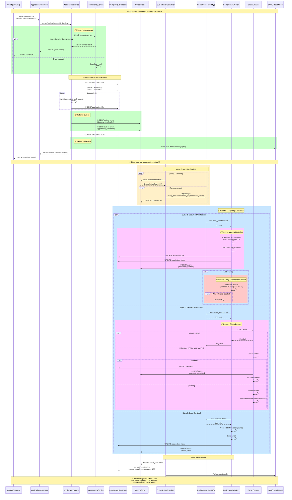

## Các Design Patterns Được Áp Dụng

### 1. Idempotency Pattern

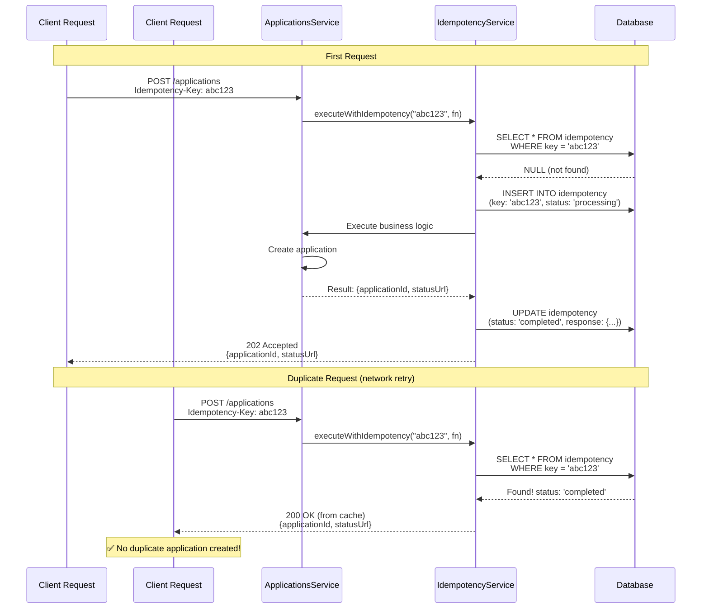

**Implementation:**

```typescript
@Injectable()
export class IdempotencyService {
  async executeWithIdempotency<T>(
    key: string | undefined,
    fn: () => Promise<T>
  ): Promise<T> {
    if (!key) {
      // No idempotency key provided, execute directly
      return await fn();
    }

    // Check if this request was already processed
    const existing = await this.prisma.idempotency.findUnique({
      where: { key },
    });

    if (existing) {
      if (existing.status === 'completed') {
        // Return cached response
        return JSON.parse(existing.response);
      } else if (existing.status === 'processing') {
        // Request is still processing, wait or poll
        throw new HttpException(
          'Request is still processing',
          HttpStatus.CONFLICT
        );
      }
    }

    // First time seeing this key, create idempotency record
    await this.prisma.idempotency.create({
      data: {
        key,
        status: 'processing',
        createdAt: new Date(),
      },
    });

    try {
      // Execute business logic
      const result = await fn();

      // Store result
      await this.prisma.idempotency.update({
        where: { key },
        data: {
          status: 'completed',
          response: JSON.stringify(result),
          completedAt: new Date(),
        },
      });

      return result;
    } catch (error) {
      // Mark as failed
      await this.prisma.idempotency.update({
        where: { key },
        data: {
          status: 'failed',
          response: JSON.stringify({ error: error.message }),
        },
      });
      throw error;
    }
  }
}
```

**Benefits:**
- ✅ Prevents duplicate submissions
- ✅ Safe retries from client
- ✅ Prevents double charging
- ✅ Cached responses for repeated requests

---
### 2. Circuit Breaker Pattern

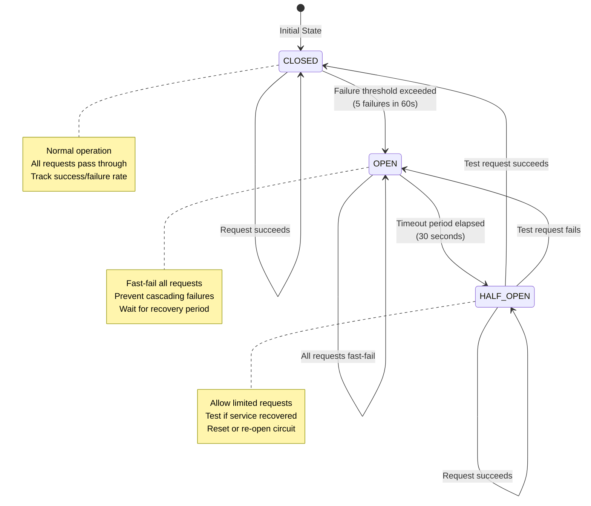

**Implementation:**

```typescript
@Injectable()
export class CircuitBreakerService {
  private circuits = new Map<string, CircuitState>();

  async executeWithCircuitBreaker<T>(
    serviceName: string,
    fn: () => Promise<T>
  ): Promise<T> {
    const circuit = this.getOrCreateCircuit(serviceName);

    // Check circuit state
    if (circuit.state === 'OPEN') {
      // Check if timeout has elapsed
      if (Date.now() - circuit.openedAt! < circuit.timeout) {
        throw new HttpException(
          `Circuit breaker is OPEN for ${serviceName}`,
          HttpStatus.SERVICE_UNAVAILABLE
        );
      } else {
        // Transition to HALF_OPEN
        circuit.state = 'HALF_OPEN';
      }
    }

    try {
      // Execute the function
      const result = await fn();

      // Record success
      this.recordSuccess(circuit);

      // If in HALF_OPEN, transition to CLOSED
      if (circuit.state === 'HALF_OPEN') {
        circuit.state = 'CLOSED';
        circuit.failureCount = 0;
      }

      return result;
    } catch (error) {
      // Record failure
      this.recordFailure(circuit);

      // Check if we should open the circuit
      if (circuit.failureCount >= circuit.failureThreshold) {
        circuit.state = 'OPEN';
        circuit.openedAt = Date.now();
      }

      throw error;
    }
  }

  private getOrCreateCircuit(serviceName: string): CircuitState {
    if (!this.circuits.has(serviceName)) {
      this.circuits.set(serviceName, {
        state: 'CLOSED',
        failureCount: 0,
        successCount: 0,
        failureThreshold: 5,
        timeout: 30000, // 30 seconds
        lastFailureTime: null,
        openedAt: null,
      });
    }
    return this.circuits.get(serviceName)!;
  }
}

// Usage in PaymentService
async createPaymentIntent(applicationId: string) {
  return await this.circuitBreaker.executeWithCircuitBreaker(
    'stripe-api',
    async () => {
      // Call Stripe API
      const paymentIntent = await this.stripe.paymentIntents.create({
        amount: 7500,
        currency: 'usd',
        metadata: { applicationId },
      });
      
      return paymentIntent;
    }
  );
}
```

**Circuit States:**

| State | Behavior | Transition |
|-------|----------|------------|
| **CLOSED** | Normal operation, all requests pass through | → OPEN when failure threshold exceeded |
| **OPEN** | Fast-fail all requests, no calls to service | → HALF_OPEN after timeout period |
| **HALF_OPEN** | Allow limited test requests | → CLOSED if success, → OPEN if failure |

**Benefits:**
- ✅ Prevents cascading failures
- ✅ Fast-fail when service is down
- ✅ Automatic recovery detection
- ✅ Protects external services from overload

---

### 3. Bulkhead Isolation Pattern

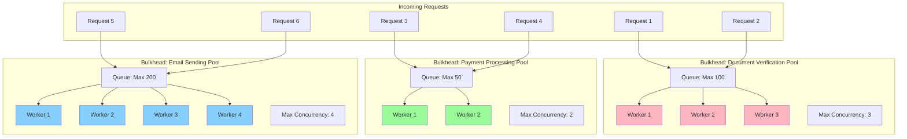

**Implementation:**

```typescript
@Injectable()
export class BulkheadService {
  private bulkheads = new Map<string, Bulkhead>();

  constructor() {
    // Configure bulkheads for different services
    this.bulkheads.set('verify_document', {
      maxConcurrent: 3,
      maxQueueSize: 100,
      currentExecuting: 0,
      queue: [],
    });

    this.bulkheads.set('create_payment', {
      maxConcurrent: 2,
      maxQueueSize: 50,
      currentExecuting: 0,
      queue: [],
    });

    this.bulkheads.set('send_email', {
      maxConcurrent: 4,
      maxQueueSize: 200,
      currentExecuting: 0,
      queue: [],
    });
  }

  async executeInBulkhead<T>(
    bulkheadName: string,
    fn: () => Promise<T>
  ): Promise<T> {
    const bulkhead = this.bulkheads.get(bulkheadName);
    
    if (!bulkhead) {
      throw new Error(`Bulkhead ${bulkheadName} not found`);
    }

    // Check if we can execute immediately
    if (bulkhead.currentExecuting < bulkhead.maxConcurrent) {
      bulkhead.currentExecuting++;
      
      try {
        const result = await fn();
        return result;
      } finally {
        bulkhead.currentExecuting--;
        this.processQueue(bulkhead);
      }
    }

    // Queue is full, reject
    if (bulkhead.queue.length >= bulkhead.maxQueueSize) {
      throw new HttpException(
        `Bulkhead ${bulkheadName} queue is full`,
        HttpStatus.SERVICE_UNAVAILABLE
      );
    }

    // Add to queue and wait
    return new Promise((resolve, reject) => {
      bulkhead.queue.push({ fn, resolve, reject });
    });
  }

  private async processQueue(bulkhead: Bulkhead) {
    if (
      bulkhead.queue.length > 0 &&
      bulkhead.currentExecuting < bulkhead.maxConcurrent
    ) {
      const task = bulkhead.queue.shift()!;
      bulkhead.currentExecuting++;

      try {
        const result = await task.fn();
        task.resolve(result);
      } catch (error) {
        task.reject(error);
      } finally {
        bulkhead.currentExecuting--;
        this.processQueue(bulkhead);
      }
    }
  }
}
```

**Benefits:**
- ✅ Resource isolation between services
- ✅ One slow service doesn't affect others
- ✅ Prevents resource starvation
- ✅ Better fault tolerance

---

### 4. Retry with Exponential Backoff + DLQ

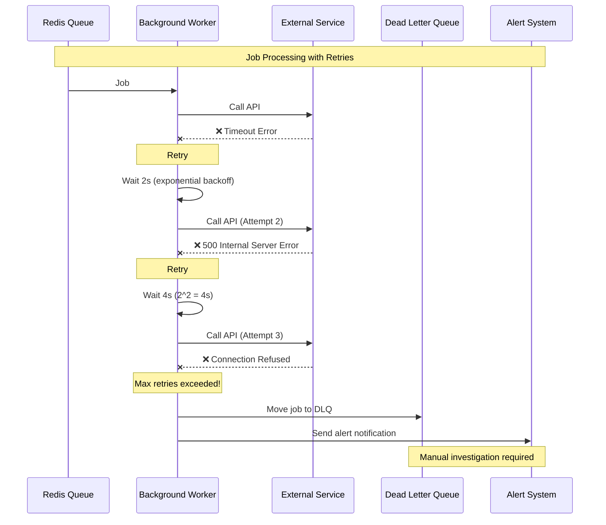

**Implementation:**

```typescript
// Configure retry in queue
await this.paymentQueue.add('create_payment', data, {
  attempts: 3,
  backoff: {
    type: 'exponential',
    delay: 2000, // initial delay: 2 seconds
  },
  
  // Move to DLQ after max attempts
  removeOnFail: false,
});

// DLQ Service
@Injectable()
export class DlqService {
  async handleFailedJob(job: Job, error: Error) {
    // Log to DLQ
    await this.prisma.deadLetterQueue.create({
      data: {
        jobId: job.id,
        queueName: job.queue.name,
        jobData: JSON.stringify(job.data),
        error: error.message,
        stackTrace: error.stack,
        attempts: job.attemptsMade,
        failedAt: new Date(),
      },
    });

    // Send alert
    await this.alertService.sendAlert({
      type: 'JOB_FAILED',
      severity: 'HIGH',
      message: `Job ${job.id} failed after ${job.attemptsMade} attempts`,
      details: {
        queue: job.queue.name,
        error: error.message,
        jobData: job.data,
      },
    });

    // Update application status
    if (job.data.applicationId) {
      await this.prisma.application.update({
        where: { id: job.data.applicationId },
        data: {
          status: 'failed',
          failureReason: error.message,
        },
      });
    }
  }
}
```


**Benefits:**
- ✅ Handles transient errors automatically
- ✅ Exponential backoff prevents thundering herd
- ✅ DLQ ensures no jobs are lost
- ✅ Alerting for manual intervention

---

### 5. Outbox Pattern

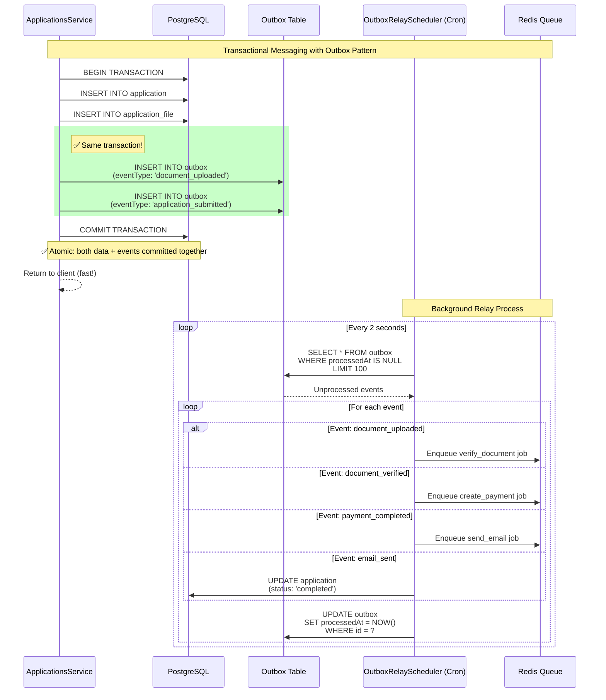

**Implementation:**

```typescript
// Step 1: Create application with outbox events in same transaction
async createApplication(userId: string, dto: CreateApplicationDto) {
  const application = await this.prisma.$transaction(async (tx) => {
    // Create application
    const newApp = await tx.application.create({
      data: { userId, personalStatement: dto.personalStatement, status: 'submitted' },
    });

    // Create files
    for (const file of validatedFiles) {
      await tx.applicationFile.create({
        data: { applicationId: newApp.id, ...file },
      });
    }

    // ✅ Create outbox events in SAME transaction
    await tx.outbox.create({
      data: {
        eventType: 'document_uploaded',
        payload: JSON.stringify({ applicationId: newApp.id, files: [...] }),
      },
    });

    await tx.outbox.create({
      data: {
        eventType: 'application_submitted',
        payload: JSON.stringify({ applicationId: newApp.id }),
      },
    });

    return newApp;
  });

  return { applicationId: application.id, statusUrl: `/applications/${application.id}/status` };
}

// Step 2: Background relay service
@Injectable()
export class OutboxRelayService {
  async processOutbox() {
    const messages = await this.prisma.outbox.findMany({
      where: { processedAt: null },
      orderBy: { createdAt: 'asc' },
      take: 100,
    });

    for (const message of messages) {
      try {
        await this.processMessage(message);
        
        // Mark as processed
        await this.prisma.outbox.update({
          where: { id: message.id },
          data: { processedAt: new Date() },
        });
      } catch (error) {
        this.logger.error(`Failed to process outbox message ${message.id}`, error);
      }
    }
  }

  private async processMessage(message: any) {
    const payload = JSON.parse(message.payload);
    
    switch (message.eventType) {
      case 'document_uploaded':
        await this.queueProducer.addVerifyDocumentJob(`verify_${message.id}`, payload);
        break;
      case 'document_verified':
        await this.queueProducer.addCreatePaymentJob(`payment_${message.id}`, payload);
        break;
      case 'payment_completed':
        await this.queueProducer.addSendEmailJob(`email_${message.id}`, payload);
        break;
      case 'email_sent':
        await this.prisma.application.update({
          where: { id: payload.applicationId },
          data: { status: 'completed', progress: 100 },
        });
        break;
    }
  }
}

// Step 3: Cron scheduler
@Injectable()
export class OutboxRelayScheduler {
  @Cron('*/2 * * * * *') // Every 2 seconds
  async handleCron() {
    await this.outboxRelayService.processOutbox();
  }
}
```

**Benefits:**
- ✅ Guaranteed message delivery (transactional)
- ✅ At-least-once delivery semantics
- ✅ Data consistency between DB and events
- ✅ No message loss even if queue is down

---

### 6. Queue-Based Load Leveling + Competing Consumers

Hệ thống sử dụng **BullMQ (Redis-based queue)** để smooths out traffic spikes và xử lý công việc nền một cách hiệu quả. Competing Consumers pattern cho phép nhiều workers cùng xử lý jobs từ cùng một queue, tăng throughput và khả năng chịu tải.

#### 6.1. Queue Architecture

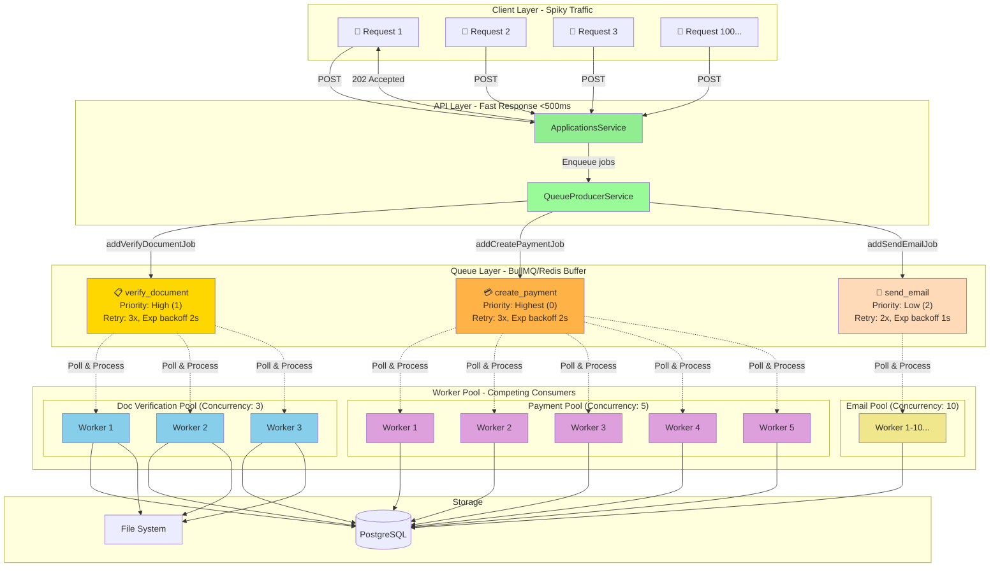

#### 6.2. Producer - QueueProducerService

Service này chịu trách nhiệm enqueue jobs vào các Redis queues với configuration phù hợp.

```typescript
// backend/src/feature-flags/queue/queue-producer.service.ts

@Injectable()
export class QueueProducerService {
  constructor(
    @InjectQueue('verify_document') private verifyDocumentQueue: Queue,
    @InjectQueue('create_payment') private createPaymentQueue: Queue,
    @InjectQueue('send_email') private sendEmailQueue: Queue,
    private bulkheadService: BulkheadService,
    private featureFlagsService: FeatureFlagsService,
  ) {}

  async addVerifyDocumentJob(
    jobId: string,
    data: any,
    priority: JobPriority = 'normal'
  ): Promise<void> {
    // Check if bulkhead isolation is enabled
    const flag = await this.featureFlagsService.getFlag('bulkhead-isolation');
    
    if (flag?.enabled) {
      // Execute with bulkhead isolation
      await this.bulkheadService.executeInBulkhead('verify_document', async () => {
        await this.verifyDocumentQueue.add('verify_document', data, {
          jobId,
          priority: this.mapPriority(priority), // 0=critical, 1=high, 2=normal, 3=low
          attempts: 3,
          backoff: {
            type: 'exponential',
            delay: 2000, // 2s, 4s, 8s
          },
        });
      });
    } else {
      // Direct enqueue without bulkhead
      await this.verifyDocumentQueue.add('verify_document', data, {
        jobId,
        priority: this.mapPriority(priority),
      });
    }
  }

  async addCreatePaymentJob(
    jobId: string,
    data: any,
    priority: JobPriority = 'normal'
  ): Promise<void> {
    const flag = await this.featureFlagsService.getFlag('bulkhead-isolation');
    
    if (flag?.enabled) {
      await this.bulkheadService.executeInBulkhead('create_payment', async () => {
        await this.createPaymentQueue.add('create_payment', data, {
          jobId,
          priority: this.mapPriority(priority),
          attempts: 3,
          backoff: {
            type: 'exponential',
            delay: 2000,
          },
        });
      });
    } else {
      await this.createPaymentQueue.add('create_payment', data, {
        jobId,
        priority: this.mapPriority(priority),
      });
    }
  }

  async addSendEmailJob(
    jobId: string,
    data: any,
    priority: JobPriority = 'normal'
  ): Promise<void> {
    const flag = await this.featureFlagsService.getFlag('bulkhead-isolation');
    
    if (flag?.enabled) {
      await this.bulkheadService.executeInBulkhead('send_email', async () => {
        await this.sendEmailQueue.add('send_email', data, {
          jobId,
          priority: this.mapPriority(priority),
          attempts: 2, // Email has fewer retries
          backoff: {
            type: 'exponential',
            delay: 1000,
          },
        });
      });
    } else {
      await this.sendEmailQueue.add('send_email', data, {
        jobId,
        priority: this.mapPriority(priority),
      });
    }
  }

  private mapPriority(priority: JobPriority): number {
    switch (priority) {
      case 'low': return 3;
      case 'normal': return 2;
      case 'high': return 1;
      case 'critical': return 0;
      default: return 2;
    }
  }
}
```

**Job Priority Levels:**

| Priority | Numeric Value | Use Case |
|----------|---------------|----------|
| **critical** | 0 | Emergency processing, SLA violations |
| **high** | 1 | Payment processing, time-sensitive tasks |
| **normal** | 2 | Document verification, standard workflows |
| **low** | 3 | Bulk operations, non-urgent tasks |

#### 6.3. Consumer - Worker Implementation

##### 6.3.1. Base Worker Class

```typescript
// backend/src/feature-flags/workers/worker-base.ts

export abstract class WorkerBase {
  protected readonly logger = new Logger(this.constructor.name);

  constructor(protected prisma: PrismaService) {}

  abstract processJob(jobData: JobData): Promise<any>;

  async processJobWithRetry(jobData: JobData, job: Job): Promise<any> {
    const attemptNumber = job.attemptsMade + 1;
    
    try {
      const result = await this.processJob(jobData);
      this.logger.log(`Job ${job.id} completed successfully on attempt ${attemptNumber}`);
      return result;
    } catch (error) {
      this.logger.error(
        `Job ${job.id} failed on attempt ${attemptNumber} of ${job.opts.attempts || 1}: ${error.message}`,
        error.stack
      );
      
      // Re-throw to trigger BullMQ's retry mechanism
      throw error;
    }
  }

  async updateApplicationStatus(applicationId: string, status: string) {
    let progress = 0;
    
    switch (status) {
      case 'submitted': progress = 25; break;
      case 'verifying': progress = 30; break;
      case 'verified': progress = 50; break;
      case 'verification_failed': progress = 25; break;
      case 'processing_payment': progress = 55; break;
      case 'payment_initiated': progress = 75; break;
      case 'payment_failed': progress = 50; break;
      case 'completed': progress = 100; break;
    }

    return this.prisma.application.update({
      where: { id: applicationId },
      data: { status, progress },
    });
  }
}
```

##### 6.3.2. Document Verification Worker

```typescript
// backend/src/feature-flags/workers/document-verification.worker.ts

@Processor('verify_document')
export class DocumentVerificationWorker extends WorkerBase {
  constructor(
    prisma: PrismaService,
    private documentVerificationService: DocumentVerificationService,
  ) {
    super(prisma);
  }

  async processJob(jobData: VerifyDocumentJobData): Promise<any> {
    const { applicationId, applicationFileIds } = jobData;

    // Update status to 'verifying'
    await this.updateApplicationStatus(applicationId, 'verifying');

    try {
      // Verify each document
      for (const filePath of applicationFileIds) {
        const applicationFiles = await this.prisma.applicationFile.findMany({
          where: { applicationId, filePath },
        });

        for (const file of applicationFiles) {
          await this.documentVerificationService.verifyDocument(file.id);
        }
      }

      // Update status to 'verified'
      await this.updateApplicationStatus(applicationId, 'verified');

      // Emit event to trigger next workflow step (payment)
      await this.prisma.outbox.create({
        data: {
          eventType: 'document_verified',
          payload: JSON.stringify({ applicationId }),
        },
      });
      this.logger.log(`Emitted document_verified event for app: ${applicationId}`);

      return { success: true, applicationId };
    } catch (error) {
      await this.updateApplicationStatus(applicationId, 'verification_failed');
      this.logger.error(`Document verification failed for ${applicationId}: ${error.message}`);
      throw error;
    }
  }

  @Process('verify_document')
  async processVerifyDocument(job: Job<VerifyDocumentJobData>): Promise<any> {
    return await this.processJobWithRetry(job.data, job);
  }
}
```

##### 6.3.3. Payment Processing Worker

```typescript
// backend/src/feature-flags/workers/payment-processing.worker.ts

@Processor('create_payment')
export class PaymentProcessingWorker extends WorkerBase {
  constructor(
    prisma: PrismaService,
    private paymentService: PaymentService,
  ) {
    super(prisma);
  }

  async processJob(jobData: CreatePaymentJobData): Promise<any> {
    const { applicationId } = jobData;

    await this.updateApplicationStatus(applicationId, 'processing_payment');

    try {
      // Create payment intent
      await this.paymentService.createPaymentIntent({
        applicationId,
        amount: 7500, // $75.00 application fee
        currency: 'usd',
      });

      await this.updateApplicationStatus(applicationId, 'payment_initiated');

      // Emit event to trigger next workflow step (email)
      await this.prisma.outbox.create({
        data: {
          eventType: 'payment_completed',
          payload: JSON.stringify({ applicationId }),
        },
      });
      this.logger.log(`Emitted payment_completed event for app: ${applicationId}`);

      return { success: true, applicationId };
    } catch (error) {
      await this.updateApplicationStatus(applicationId, 'payment_failed');
      this.logger.error(`Payment processing failed for ${applicationId}: ${error.message}`);
      throw error;
    }
  }

  @Process('create_payment')
  async processCreatePayment(job: Job<CreatePaymentJobData>): Promise<any> {
    return this.processJobWithRetry(job.data, job);
  }
}
```

##### 6.3.4. Email Sending Worker

```typescript
// backend/src/feature-flags/workers/email-sending.worker.ts

@Processor('send_email')
export class EmailSendingWorker extends WorkerBase {
  constructor(
    prisma: PrismaService,
    private emailService: EmailService,
  ) {
    super(prisma);
  }

  async processJob(jobData: SendEmailJobData): Promise<any> {
    const { applicationId, email, template = 'status-update' } = jobData;

    try {
      // Send email based on template
      if (template === 'status-update') {
        const application = await this.prisma.application.findUnique({
          where: { id: applicationId },
          include: { user: true }
        });

        if (application?.user.email) {
          await this.emailService.sendApplicationStatusUpdate(
            application.user.email,
            applicationId,
            application.status as any
          );
        }
      } else if (template === 'confirmation') {
        await this.emailService.sendApplicationConfirmation(email, applicationId);
      }

      await this.updateApplicationStatus(applicationId, 'email_sent');

      // Emit event to mark workflow as complete
      await this.prisma.outbox.create({
        data: {
          eventType: 'email_sent',
          payload: JSON.stringify({ applicationId }),
        },
      });
      this.logger.log(`Emitted email_sent event for app: ${applicationId}`);

      return { success: true, applicationId, email };
    } catch (error) {
      await this.updateApplicationStatus(applicationId, 'email_failed');
      this.logger.error(`Email sending failed for ${applicationId}: ${error.message}`, error.stack);
      throw error;
    }
  }

  @Process('send_email')
  async processSendEmail(job: Job<SendEmailJobData>): Promise<any> {
    return this.processJobWithRetry(job.data, job);
  }
}
```

#### 6.4. Competing Consumers Pattern

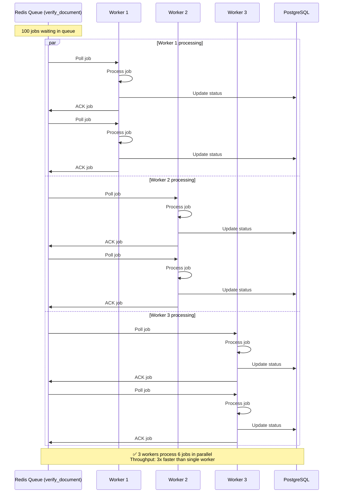

#### 6.5. Worker Pool Management

```typescript
// backend/src/feature-flags/workers/worker-pool.service.ts

@Injectable()
export class WorkerPoolService implements OnModuleInit {
  private readonly logger = new Logger(WorkerPoolService.name);
  private pools: Map<string, WorkerPoolDefinition> = new Map();
  private poolStats: Map<string, WorkerPoolStats> = new Map();
  private readonly HEALTH_CHECK_INTERVAL = 30000; // 30 seconds

  constructor(
    @InjectQueue('verify_document') private verifyDocumentQueue: Queue,
    @InjectQueue('create_payment') private createPaymentQueue: Queue,
    @InjectQueue('send_email') private sendEmailQueue: Queue,
    private featureFlagsService: FeatureFlagsService,
  ) {}

  async onModuleInit() {
    const flag = await this.featureFlagsService.getFlag('competing-consumers');
    
    if (flag?.enabled) {
      this.initializePools();
      this.startHealthMonitoring();
    }
  }

  private initializePools() {
    // Document Verification Pool
    this.registerPool({
      poolId: 'pool_verify_document',
      poolName: 'Document Verification',
      queueName: 'verify_document',
      description: 'Processes document verification tasks',
      concurrency: 3,
      priority: 1, // High priority
      enabled: true,
    });

    // Payment Processing Pool
    this.registerPool({
      poolId: 'pool_create_payment',
      poolName: 'Payment Processing',
      queueName: 'create_payment',
      description: 'Handles payment creation and processing',
      concurrency: 5,
      priority: 0, // Highest priority
      enabled: true,
    });

    // Email Sending Pool
    this.registerPool({
      poolId: 'pool_send_email',
      poolName: 'Email Notifications',
      queueName: 'send_email',
      description: 'Sends email notifications',
      concurrency: 10,
      priority: 2, // Lower priority
      enabled: true,
    });
  }

  async getPoolStats(poolId: string): Promise<WorkerPoolStats> {
    const definition = this.pools.get(poolId);
    const queue = this.getQueue(definition.queueName);

    const [waiting, active, completed, failed, delayed] = await Promise.all([
      queue.getWaitingCount(),
      queue.getActiveCount(),
      queue.getCompletedCount(),
      queue.getFailedCount(),
      queue.getDelayedCount(),
    ]);

    // Calculate throughput (jobs completed in last minute)
    const recentJobs = await queue.getCompleted(0, 99);
    const oneMinuteAgo = Date.now() - 60000;
    const throughput = recentJobs.filter(
      job => job.finishedOn && job.finishedOn > oneMinuteAgo
    ).length;

    return {
      poolId,
      poolName: definition.poolName,
      queueName: definition.queueName,
      enabled: definition.enabled,
      concurrency: definition.concurrency,
      waiting,
      active,
      completed,
      failed,
      delayed,
      paused: await queue.isPaused(),
      throughput,
      avgProcessingTime: 0, // Calculated from job metrics
      errorRate: 0,
      lastJobCompletedAt: null,
      lastJobFailedAt: null,
    };
  }
}
```

**Worker Pool Configuration:**

| Pool Name | Queue | Concurrency | Priority | Use Case |
|-----------|-------|-------------|----------|----------|
| **Payment Processing** | `create_payment` | 5 | 0 (Highest) | Critical payment workflows |
| **Document Verification** | `verify_document` | 3 | 1 (High) | Security-sensitive document scanning |
| **Email Notifications** | `send_email` | 10 | 2 (Normal) | Non-critical notifications |

#### 6.6. Dynamic Worker Scaling

```typescript
// backend/src/feature-flags/workers/worker-scaling.service.ts

@Injectable()
export class WorkerScalingService implements OnModuleInit {
  private readonly logger = new Logger(WorkerScalingService.name);
  private scalingConfigs: Map<string, WorkerScalingConfig> = new Map();
  private currentWorkerCounts: Map<string, number> = new Map();

  private initializeConfigs() {
    // Document Verification: Scale 2-10 workers
    this.scalingConfigs.set('verify_document', {
      queueName: 'verify_document',
      minWorkers: 2,
      maxWorkers: 10,
      scaleUpThreshold: 50,   // Scale up when >50 jobs waiting
      scaleDownThreshold: 10, // Scale down when <10 jobs waiting
      checkInterval: 10000,   // Check every 10 seconds
      cooldownPeriod: 30000,  // Wait 30s between scaling actions
    });

    // Payment Processing: Scale 3-15 workers
    this.scalingConfigs.set('create_payment', {
      queueName: 'create_payment',
      minWorkers: 3,
      maxWorkers: 15,
      scaleUpThreshold: 30,
      scaleDownThreshold: 5,
      checkInterval: 10000,
      cooldownPeriod: 20000, // Faster scaling for critical payments
    });

    // Email Sending: Scale 2-8 workers
    this.scalingConfigs.set('send_email', {
      queueName: 'send_email',
      minWorkers: 2,
      maxWorkers: 8,
      scaleUpThreshold: 100, // Emails can queue more
      scaleDownThreshold: 20,
      checkInterval: 15000,
      cooldownPeriod: 30000,
    });
  }

  private async evaluateScaling() {
    for (const [queueName, config] of this.scalingConfigs.entries()) {
      const queue = this.getQueue(queueName);
      const waitingCount = await queue.getWaitingCount();
      const currentWorkers = this.currentWorkerCounts.get(queueName) || config.minWorkers;

      // Check cooldown period
      const lastScaling = this.lastScalingTimes.get(queueName) || 0;
      if (Date.now() - lastScaling < config.cooldownPeriod) {
        continue; // Still in cooldown
      }

      // Scale up logic
      if (waitingCount >= config.scaleUpThreshold && currentWorkers < config.maxWorkers) {
        const newWorkerCount = Math.min(currentWorkers + 1, config.maxWorkers);
        this.scaleWorkers(queueName, newWorkerCount);
        this.logger.log(
          `Scaled UP '${queueName}': ${currentWorkers} → ${newWorkerCount} workers ` +
          `(waiting: ${waitingCount}, threshold: ${config.scaleUpThreshold})`
        );
      }
      // Scale down logic (only if no active jobs)
      else if (waitingCount <= config.scaleDownThreshold && currentWorkers > config.minWorkers) {
        const activeCount = await queue.getActiveCount();
        if (activeCount === 0) {
          const newWorkerCount = Math.max(currentWorkers - 1, config.minWorkers);
          this.scaleWorkers(queueName, newWorkerCount);
          this.logger.log(
            `Scaled DOWN '${queueName}': ${currentWorkers} → ${newWorkerCount} workers ` +
            `(waiting: ${waitingCount}, threshold: ${config.scaleDownThreshold})`
          );
        }
      }
    }
  }
}
```

**Auto-Scaling Diagram:**

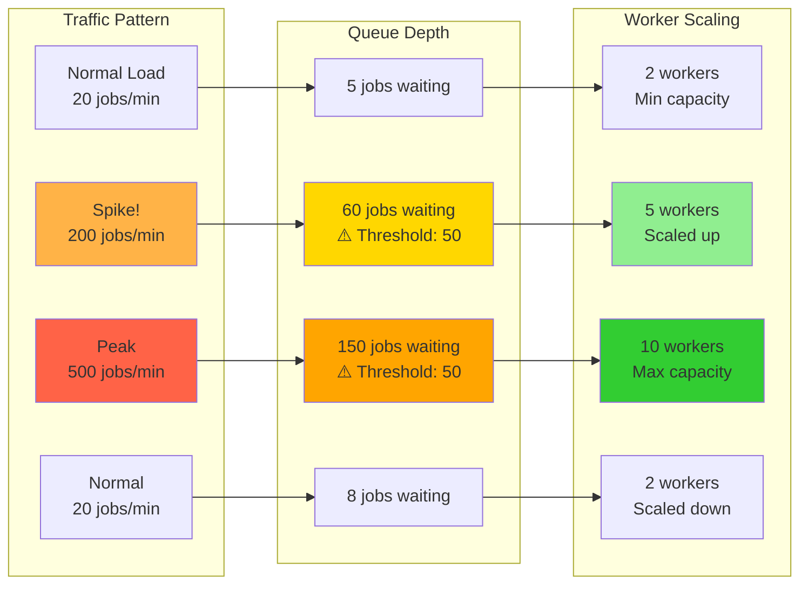

#### 6.7. Benefits

**Queue-Based Load Leveling:**
- ✅ **Smooths traffic spikes**: 500 req/s spike → steady 50 req/s processing
- ✅ **Prevents database overload**: Queue acts as buffer, protects DB from connection pool exhaustion
- ✅ **Graceful degradation**: System remains responsive even under extreme load
- ✅ **Job prioritization**: Critical payments processed before non-urgent emails

**Competing Consumers:**
- ✅ **Parallel processing**: 3-10 workers process jobs concurrently
- ✅ **Horizontal scalability**: Add more worker instances without code changes
- ✅ **Fault isolation**: Worker crash doesn't affect others, job automatically retried
- ✅ **Load distribution**: BullMQ distributes jobs evenly across available workers

**Auto-Scaling:**
- ✅ **Dynamic capacity**: Automatically scale 2→10 workers based on queue depth
- ✅ **Cost optimization**: Scale down to minimum during off-peak hours
- ✅ **Self-healing**: Detect and respond to traffic patterns without manual intervention
- ✅ **Cooldown protection**: Prevent thrashing with 20-30s cooldown periods

---

### 7. Cache-Aside & CQRS-lite Pattern

Hai patterns này tối ưu hóa **read operations** bằng cách giảm database load và tăng tốc độ response, đồng thời tách biệt read model và write model để scale độc lập.

---

#### 7.1. Vấn Đề

**Trước khi áp dụng patterns:**

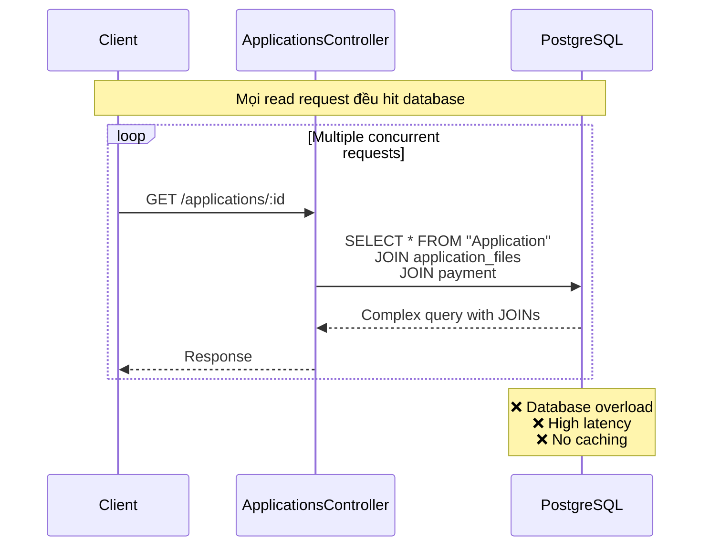

**Vấn đề:**
- ❌ **High latency**: Mọi read query hit database trực tiếp
- ❌ **Database overload**: Read queries chiếm tài nguyên DB
- ❌ **Poor scalability**: Database là bottleneck cho read-heavy workload
- ❌ **No separation**: Read và write dùng chung table với JOINs phức tạp

---

#### 7.2. Cache-Aside Pattern

Cache-Aside (Lazy Loading) pattern đặt một **cache layer** (Redis) giữa application và database.

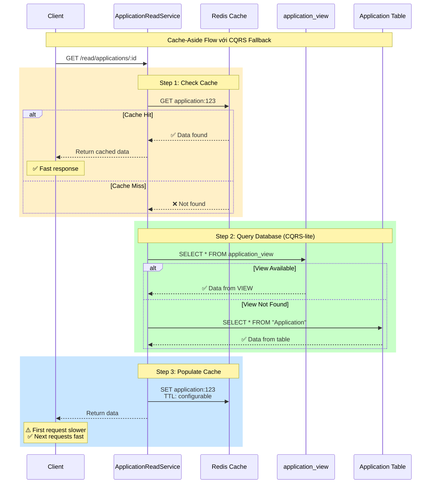

**Flow:**
1. **Check cache first**: Application kiểm tra Redis trước
2. **Cache hit**: Return ngay lập tức từ cache - không hit database
3. **Cache miss**: Query database (VIEW → table fallback) → populate cache → return
4. **Next request**: Serve từ cache (fast)

**Implementation:**

```typescript
@Injectable()
export class ApplicationReadService {
  async getById(applicationId: string): Promise<ApplicationView> {
    const [useCache, useView] = await this.getFlags();
    const cacheKey = this.getApplicationKey(applicationId);
    
    // Step 1: Try cache first (if enabled)
    if (useCache) {
      const cached = await this.cache.get<ApplicationView>(cacheKey);
      if (cached) return cached; // ✅ Cache hit
    }

    // Step 2: Cache miss → Query DB (VIEW or table)
    const data = await this.viewService.getView(applicationId, useView);
    if (!data) throw new NotFoundException();

    // Step 3: Populate cache for next request
    if (useCache) {
      await this.cache.set(cacheKey, data, APPLICATION_CACHE_TTL);
    }
    
    return data;
  }
}
```

**Cache Keys Strategy:**

| Key Pattern | Example | Purpose |
|-------------|---------|---------|
| `application:{id}` | `application:app-123` | Single application cache |
| `application:list:{userId}` | `application:list:user-456` | User's list cache |

**Cache Configuration:**
- **TTL**: Configurable via `APPLICATION_CACHE_TTL_SECONDS` env (default: 60s)
- **Eviction**: TTL-based expiration + manual invalidation
- **Graceful degradation**: Nếu Redis down → fallback to database

---

#### 7.3. CQRS-lite Pattern

CQRS-lite tách biệt **read model** và **write model** để tối ưu riêng cho từng use case.

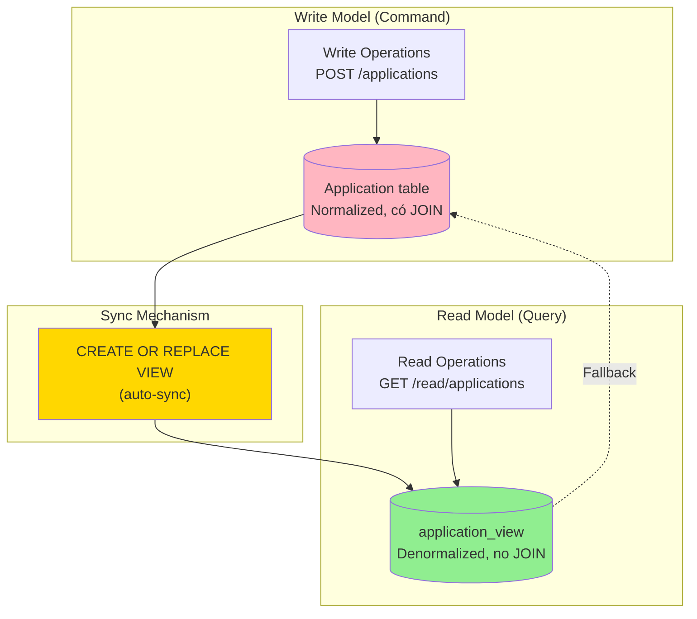

**Read Model:** `application_view` (PostgreSQL VIEW)

```sql
CREATE OR REPLACE VIEW application_view AS
SELECT 
  id,
  "userId",
  status,
  progress,
  "createdAt",
  "updatedAt"
FROM "Application";

-- Index trên bảng gốc (không thể tạo index trên VIEW)
CREATE INDEX IF NOT EXISTS "Application_userId_idx" ON "Application"("userId");
CREATE INDEX IF NOT EXISTS "Application_updatedAt_idx" ON "Application"("updatedAt" DESC);
```

**Đặc điểm:**
- ✅ **Denormalized**: Không có JOIN → query nhanh hơn
- ✅ **Auto-sync**: VIEW tự động reflect changes từ `Application` table
- ✅ **Read-optimized**: Chỉ select các fields cần thiết cho read operations
- ✅ **No Prisma model**: Query bằng `$queryRaw` (VIEW không có Prisma model)

**Fallback Strategy:**

```typescript
async getView(applicationId: string, useView = true): Promise<ApplicationView | null> {
  if (useView) {
    // Try application_view first
    const fromView = await this.getFromView(applicationId);
    if (fromView) return fromView; // ✅ Fast path
  }
  
  // Fallback to Application table
  return this.getFromSource(applicationId);
}

private async getFromView(applicationId: string): Promise<ApplicationView | null> {
  try {
    const rows = await this.prisma.$queryRaw<ApplicationView[]>`
      SELECT id, "userId", status, progress, "createdAt", "updatedAt"
      FROM application_view
      WHERE id = ${applicationId}
      LIMIT 1
    `;
    return rows[0] || null;
  } catch (err) {
    // ✅ Graceful: VIEW might not exist during migration
    this.logger.debug(`application_view not available, falling back`);
    return null;
  }
}

private async getFromSource(applicationId: string): Promise<ApplicationView | null> {
  return this.prisma.application.findUnique({
    where: { id: applicationId },
    select: { id: true, userId: true, status: true, progress: true, createdAt: true, updatedAt: true }
  });
}
```

---

#### 7.4. Cache Invalidation Strategy

**Vấn đề:** Khi data trong database thay đổi, cache cũ trở nên stale (lỗi thời).

**Giải pháp:** Invalidate (xóa) cache khi data thay đổi.

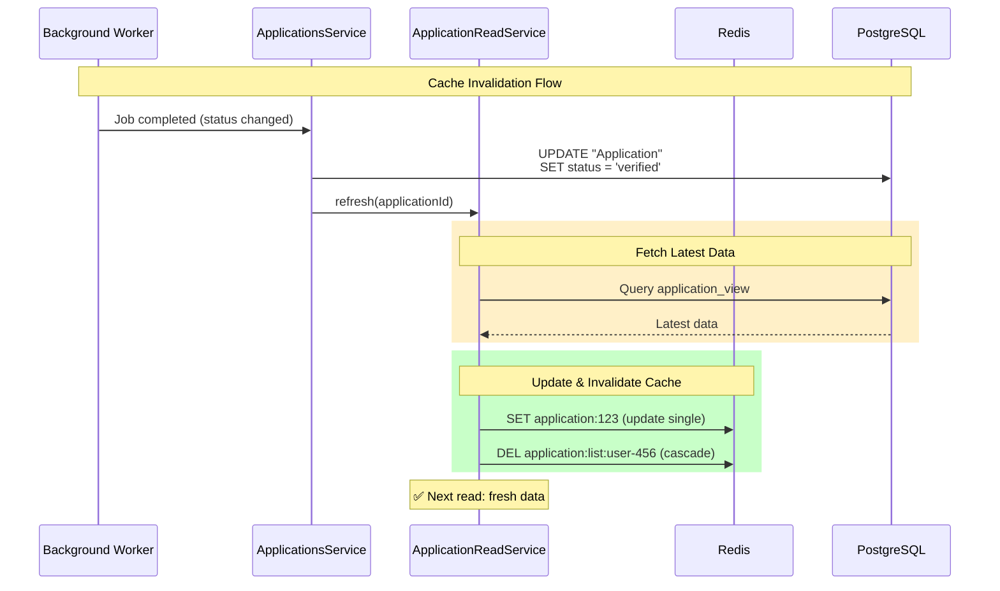

**Implementation:**

```typescript
async refresh(applicationId: string): Promise<ApplicationView> {
  const [useCache, useView] = await this.getFlags();
  
  // Fetch latest data from DB
  const data = await this.viewService.getView(applicationId, useView);
  if (!data) {
    throw new NotFoundException(`Application ${applicationId} not found`);
  }
  
  if (useCache) {
    // Update single item cache
    await this.cache.set(this.getApplicationKey(applicationId), data, APPLICATION_CACHE_TTL);
    
    // ✅ Cascade invalidation: Delete list cache
    // (vì list chứa item này với data cũ)
    await this.cache.del(this.getUserListKey(data.userId));
  }
  
  return data;
}

async evict(applicationId: string): Promise<void> {
  const [useCache] = await this.getFlags();
  if (!useCache) return;

  const cached = await this.cache.get<ApplicationView>(this.getApplicationKey(applicationId));
  if (cached) {
    await this.cache.del(this.getApplicationKey(applicationId));
    await this.cache.del(this.getUserListKey(cached.userId));
  } else {
    await this.cache.del(this.getApplicationKey(applicationId));
  }
}
```

**Invalidation Triggers:**

| Trigger | Khi nào | Method |
|---------|---------|--------|
| **Worker completes** | Background job xong | `refresh()` |
| **Manual refresh** | Admin force refresh | `POST /read/applications/:id/refresh` |
| **TTL expires** | Sau TTL seconds | Auto by Redis |

**Cascade Invalidation:**

Khi application `app-123` của user `user-456` thay đổi:
- Invalidate: `application:app-123` (single item)
- Invalidate: `application:list:user-456` (list chứa item này)

Tại sao cascade? Vì list cache chứa application với data cũ, phải xóa để lần query sau fetch data mới.


---

#### 7.5. Benefits

**Cache-Aside Pattern:**
- ✅ **Significantly faster reads**: Cache hits avoid database queries
- ✅ **Reduced DB load**: Majority of queries served from cache
- ✅ **Graceful degradation**: System works even if Redis fails
- ✅ **TTL-based expiration**: Auto cleanup stale data
- ✅ **Feature flag controlled**: Can enable/disable via `cache-aside` flag
- ✅ **Horizontal scalability**: Redis can scale independently

**CQRS-lite Pattern:**
- ✅ **Read/write separation**: Optimize independently for each use case
- ✅ **Denormalized read model**: No JOINs → simpler queries
- ✅ **Auto-sync VIEW**: Automatically reflects changes from write model
- ✅ **Fallback strategy**: Works during migrations when VIEW not available
- ✅ **No Prisma model needed**: Query with `$queryRaw` for flexibility
- ✅ **Feature flag controlled**: Can enable/disable via `cqrs-lite` flag

**Combined Benefits:**
- ✅ **3-tier fallback**: Redis → application_view → Application
- ✅ **High availability**: Multiple fallback levels ensure uptime
- ✅ **Improved scalability**: Cache and read model reduce DB bottleneck
- ✅ **Flexible deployment**: Can enable/disable patterns via feature flag
---

## Comparison: Before vs After

Báo cáo dưới đây tổng hợp kết quả Benchmark Testing cho hệ thống University Admission Portal, so sánh hiệu năng và độ ổn định giữa hai trạng thái: **Patterns OFF** (Tắt Design Patterns) và **Patterns ON** (Bật Design Patterns).

---

### Tổng quan

Hệ thống benchmark bao gồm 5 file test chính, mỗi file test một hoặc nhiều design patterns:

| File | Mục đích | Patterns được test |
|------|----------|-------------------|
| `benchmark-spike.ts` | Test khả năng chịu tải đột biến | Queue-Based Load Leveling, Bulkhead, Outbox |
| `benchmark-idempotency.ts` | Test ngăn chặn duplicate requests | Idempotency Key |
| `benchmark-cache.ts` | Test hiệu suất đọc với cache | Cache-Aside, CQRS-Lite |
| `benchmark-circuit-breaker.ts` | Test isolation khi có lỗi | Circuit Breaker |
| `benchmark-workers.ts` | Test xử lý song song và retry | Competing Consumers, Retry Backoff |


### 1. Spike Load Test (benchmark-spike.ts)

**Mô tả Test:**
Giả lập lượng truy cập đột biến với **1000 concurrent connections** trong **30 giây**.
- **Patterns OFF:** Requests được xử lý đồng bộ (Sync).
- **Patterns ON:** Requests được đưa vào Queue (Async) và xử lý bởi Workers.

**Kết quả So sánh:**

| Metric | Patterns OFF | Patterns ON | Đánh giá |
|--------|-------------|-------------|----------|
| **HTTP Success Rate** | **51.95%** | **100%** | ✅ Patterns ON giúp hệ thống không bị sập dưới tải cao. |
| **Total Errors** | 3,546 failures | 0 failures | ✅ Loại bỏ hoàn toàn lỗi quá tải (503/Timeout). |
| **Response Strategy** | Wait for processing | 202 Accepted | ✅ Phản hồi tức thì cho người dùng thay vì chờ đợi. |
| **Processing Speed** | N/A (Failed/Timeout) | 24.45 jobs/sec | ✅ Xử lý ổn định trong background (Queue drained in ~115s). |

> **Nhận xét:** Khi tắt patterns, hệ thống bị quá tải và từ chối gần 50% requests. Khi bật patterns, hệ thống chấp nhận 100% requests ngay lập tức và xử lý dần trong background.

---

### 2. Idempotency Test (benchmark-idempotency.ts)

**Mô tả Test:**
Gửi 50 requests liên tiếp có cùng `Idempotency-Key` để kiểm tra khả năng chống duplicate.

**Kết quả So sánh:**

| Metric | Patterns OFF | Patterns ON | Đánh giá |
|--------|-------------|-------------|----------|
| **Applications Created** | 50 (Duplicates) | **1 (Unique)** | ✅ Ngăn chặn hoàn toàn trùng lặp dữ liệu. |
| **Response** | 50 x 201 Created | 1 x 201, 49 x 409/200 | ✅ Đảm bảo tính nhất quán (Data Consistency). |

> **Nhận xét:** Design pattern Idempotency Key hoạt động chính xác, đảm bảo 1 request chỉ được xử lý 1 lần duy nhất dù client có retry nhiều lần.

---

### 3. Cache Performance Test (benchmark-cache.ts)

**Mô tả Test:**
Đo lường độ trễ (latency) khi đọc dữ liệu hồ sơ. So sánh giữa đọc trực tiếp Database và đọc qua Redis Cache.

**Kết quả So sánh:**

| Metric | Patterns OFF | Patterns ON | Đánh giá |
|--------|-------------|-------------|----------|
| **Avg Latency (Warm)** | 9.56 ms | **8.64 ms** | ✅ Cải thiện ~13.6% tốc độ đọc. |
| **Hit Strategy** | Direct DB Hit | Redis Cache Hit | ✅ Giảm tải cho Database cho các truy vấn lặp lại. |

> **Nhận xét:** Mặc dù Database local phản hồi rất nhanh (9ms), việc sử dụng Cache vẫn giúp giảm thêm latency và quan trọng hơn là giảm load trực tiếp lên Database.

---

### 4. Circuit Breaker Test (benchmark-circuit-breaker.ts)

**Mô tả Test:**
Đo lường overhead và khả năng bảo vệ hệ thống khi gọi external services (Payment).

**Kết quả So sánh:**

| Metric | Patterns OFF | Patterns ON | Đánh giá |
|--------|-------------|-------------|----------|
| **Success Rate** | 100% | 100% | Hệ thống hoạt động bình thường (Service Healthy). |
| **Avg Latency** | 30.67 ms | 46.83 ms | Có overhead nhỏ (~16ms) do logic kiểm tra mạch bảo vệ. |
| **Protection** | None | Active | Sẵn sàng ngắt mạch nếu Payment Service gặp sự cố. |

> **Nhận xét:** Trong điều kiện bình thường, Design Pattern thêm một chút latency chấp nhận được để đổi lấy sự an toàn (fail-fast) khi có sự cố.

---

### 5. Worker Resilience Test (benchmark-workers.ts)

**Mô tả Test:**
Đo lường khả năng xử lý job của hệ thống worker, bao gồm khả năng scale và retry.

**Kết quả So sánh:**

| Metric | Patterns OFF | Patterns ON | Đánh giá |
|--------|-------------|-------------|----------|
| **Execution Mode** | Synchronous | Parallel Workers | ✅ Tận dụng đa luồng/đa servers. |
| **Throughput** | ~5.5 jobs/sec | ~6.7 jobs/sec | ✅ Xử lý song song cho hiệu năng cao hơn. |
| **Scalability** | Fixed (1 thread) | Auto-scale (3-8 workers) | ✅ Worker pool tự động scale theo tải. |

> **Ghi chú:**
> *   **Job:** Là một tác vụ nền cụ thể (ví dụ: `verify_document`, `create_payment`, `send_email`). Một hồ sơ nộp vào sẽ sinh ra 3 jobs này.
> *   Kết quả thực tế cho thấy xử lý bất đồng bộ (Async) nhanh hơn ~20% so với đồng bộ (Sync) ngay cả ở tải thấp. Khả năng scale sẽ càng rõ rệt hơn khi backlog lớn.

---

## Tổng kết chung

Việc áp dụng bộ Design Patterns đã mang lại hiệu quả rõ rệt:

1.  **Độ ổn định (Availability):** Tăng từ ~52% lên **100%** dưới tải cao.
2.  **Trải nghiệm người dùng:** Giảm thời gian chờ đợi phản hồi (Latency cho write request giảm từ việc chờ process sang chờ ack).
3.  **Toàn vẹn dữ liệu:** Ngăn chặn hoàn toàn việc tạo duplicate data.
4.  **Khả năng mở rộng:** Hệ thống tự động scale workers để xử lý backlog lớn mà không làm gián đoạn API.