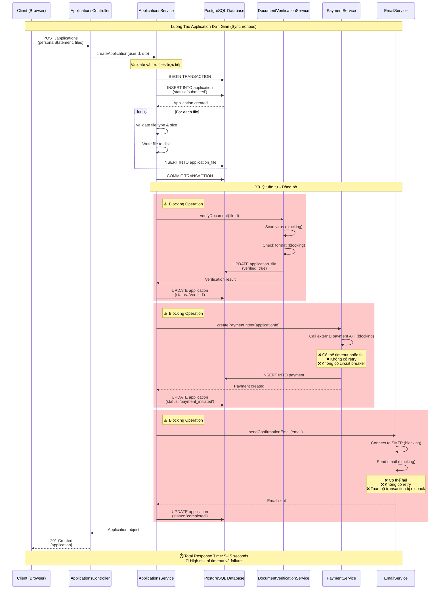
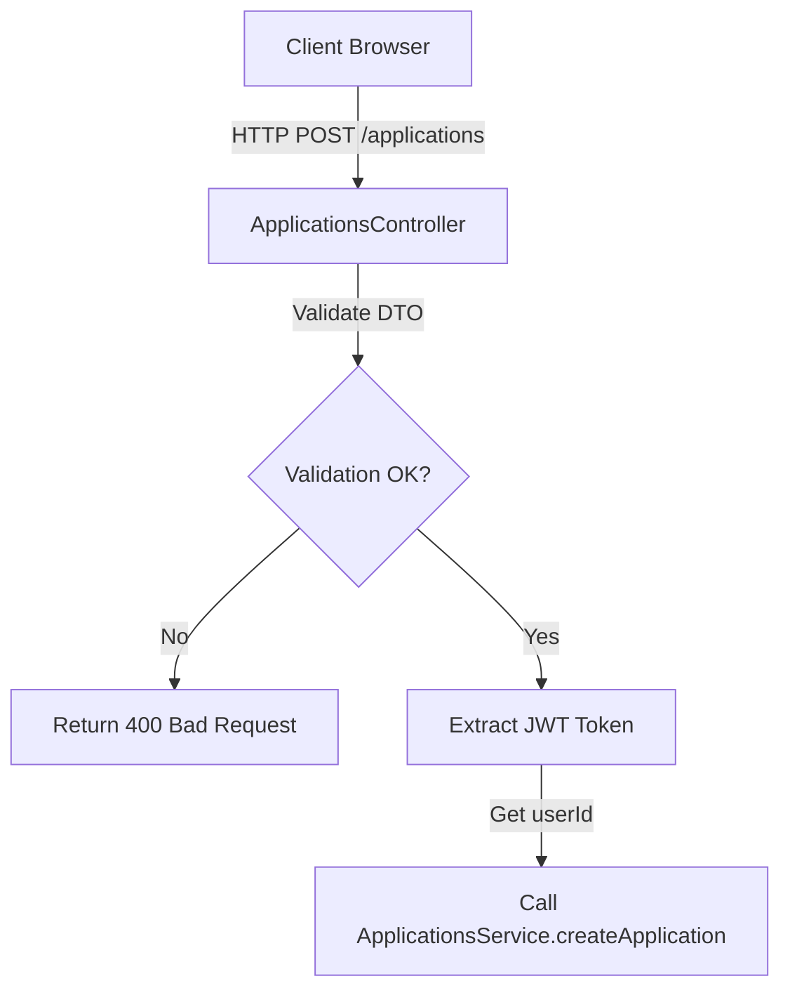
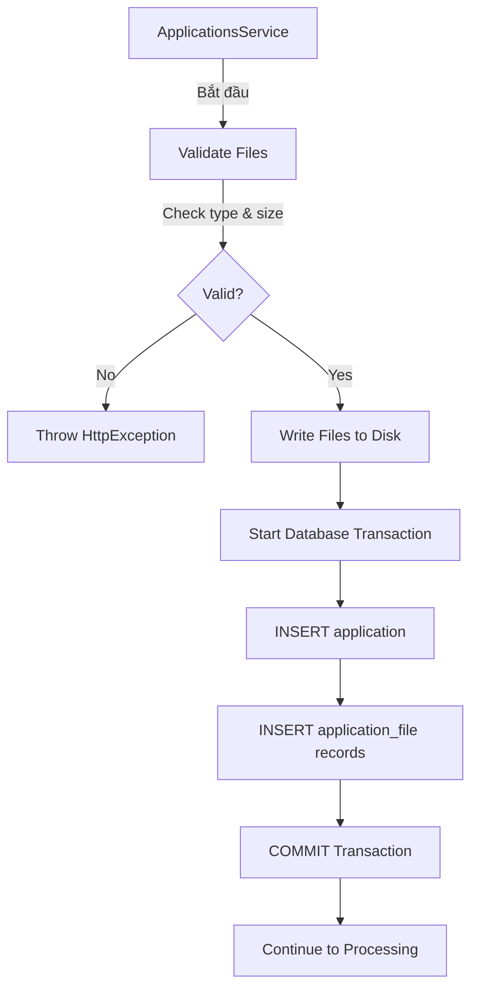
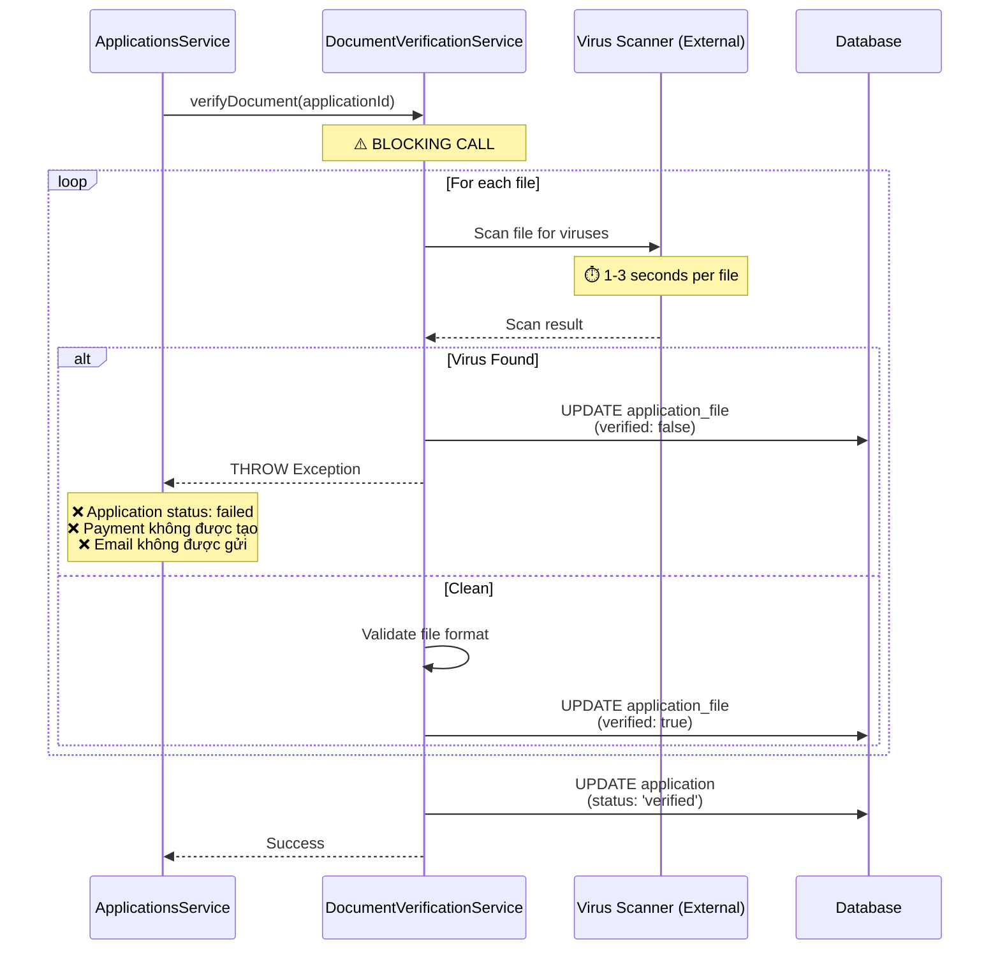
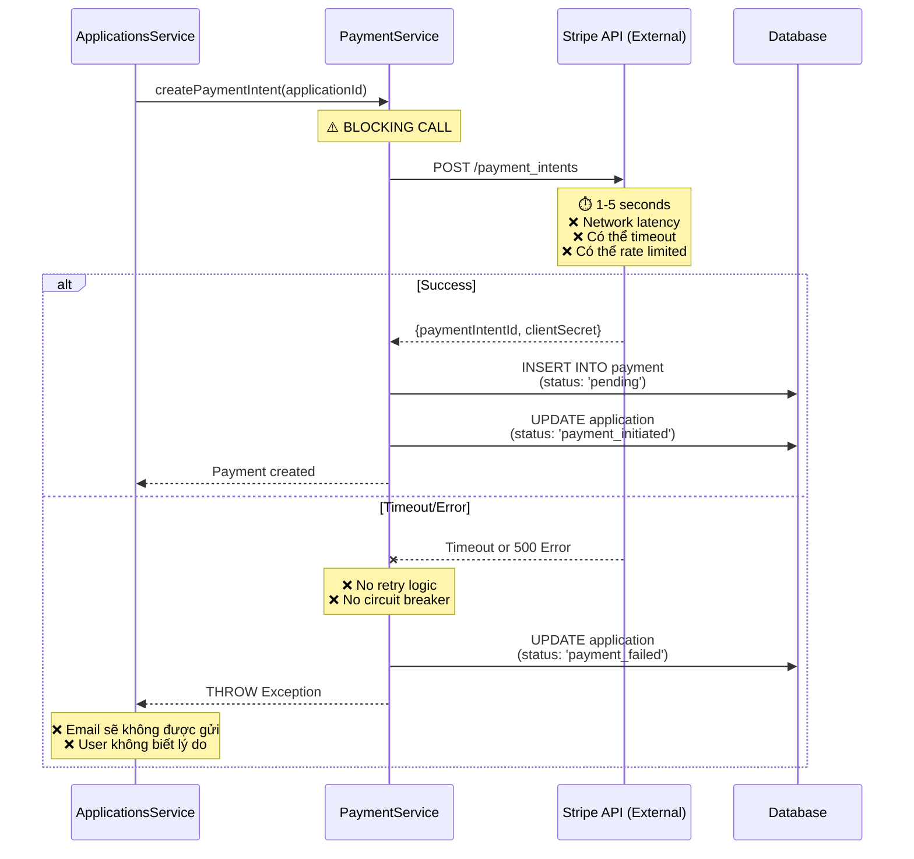
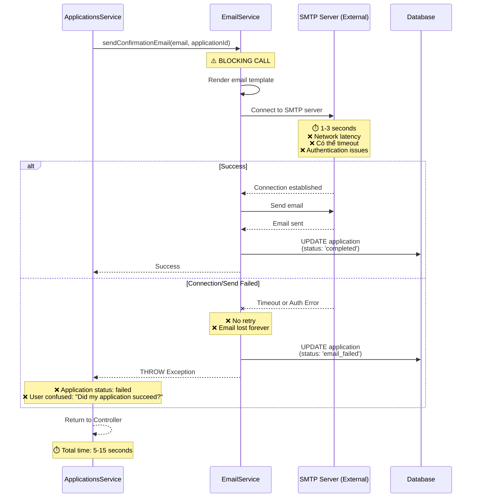
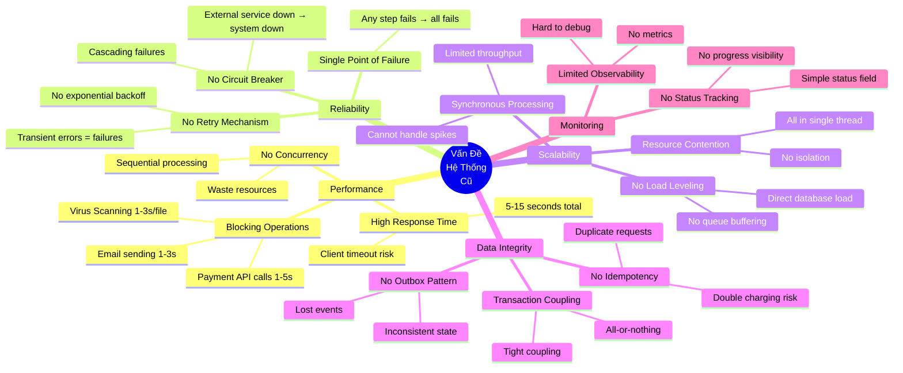
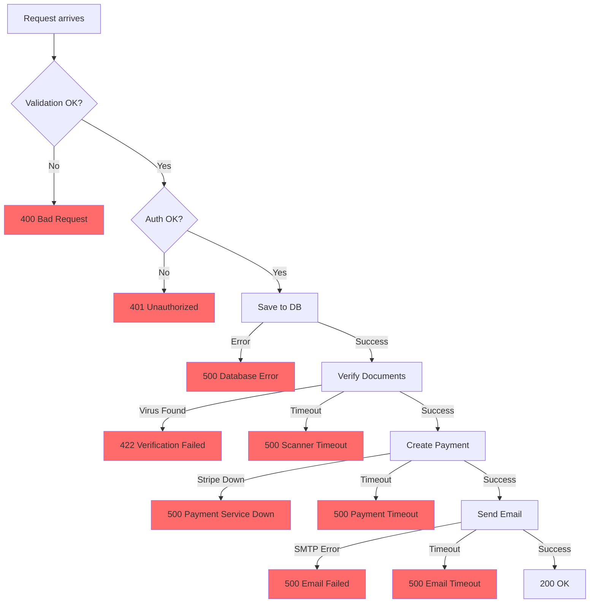

# Luồng Hoạt Động Hệ Thống Trước Khi Áp Dụng Design Patterns

## Tổng Quan

Tài liệu này mô tả chi tiết luồng hoạt động của hệ thống University Admission Portal **trước khi** áp dụng các design patterns như Queue-Based Load Leveling, Outbox Pattern, Circuit Breaker, Bulkhead Isolation, Idempotency, và CQRS.

## Kiến Trúc Đơn Giản Ban Đầu

Trong phiên bản đơn giản ban đầu, hệ thống hoạt động theo mô hình **synchronous processing** và **direct database access** không có các cơ chế bảo vệ và tối ưu hóa phức tạp.

## Mermaid Diagram - Luồng Xử Lý Đơn Giản



## Luồng Chi Tiết Theo Từng Bước

### 1. Client Gửi Request Tạo Application



**Request Format:**
```typescript
POST /applications
Headers:
  Authorization: Bearer <JWT_TOKEN>
  Content-Type: multipart/form-data

Body:
  personalStatement: "I want to study..."
  files: [file1.pdf, file2.pdf, ...]
```

**Vấn đề:**
- ❌ Request phải chờ tất cả processing steps hoàn thành
- ❌ Timeout risk cao khi có nhiều files hoặc external services chậm
- ❌ Không thể retry nếu một step fail
- ❌ Client blocking quá lâu

---

### 2. Lưu Application và Files Vào Database



**Code Đơn Giản (Không có Patterns):**

```typescript
async createApplication(userId: string, dto: CreateApplicationDto) {
  // ❌ No idempotency check
  // ❌ Duplicate requests sẽ tạo multiple applications
  
  // Validate files synchronously
  const validatedFiles = await this.validateAndStoreFiles(dto.files);
  // ❌ Blocking I/O operation
  
  // Single transaction - all or nothing
  const application = await this.prisma.$transaction(async (tx) => {
    const newApp = await tx.application.create({
      data: {
        userId,
        personalStatement: dto.personalStatement,
        status: 'submitted',
      },
    });
    
    // Insert files
    for (const file of validatedFiles) {
      await tx.applicationFile.create({
        data: {
          applicationId: newApp.id,
          fileName: file.originalName,
          fileType: file.mimeType,
          fileSize: file.size,
          filePath: file.path,
        },
      });
    }
    
    return newApp;
  });
  
  // ❌ Directly call verification - BLOCKING
  await this.verifyDocuments(application.id);
  
  // ❌ Directly call payment - BLOCKING
  await this.createPayment(application.id);
  
  // ❌ Directly send email - BLOCKING
  await this.sendEmail(application.id);
  
  // ⏱️ Client đã đợi 5-15 giây ở đây
  return application;
}
```

**Vấn đề:**
- ❌ Không có idempotency - duplicate requests tạo duplicate data
- ❌ File validation blocking request
- ❌ All processing synchronous
- ❌ Nếu email fails, toàn bộ transaction rollback

---

### 3. Xử Lý Document Verification (Synchronous)



**Code Đơn Giản:**

```typescript
async verifyDocuments(applicationId: string) {
  const files = await this.prisma.applicationFile.findMany({
    where: { applicationId },
  });
  
  for (const file of files) {
    // ❌ Synchronous virus scan - BLOCKS for 1-3 seconds per file
    const scanResult = await this.virusScanner.scan(file.filePath);
    
    if (!scanResult.clean) {
      // ❌ Entire application fails
      await this.prisma.application.update({
        where: { id: applicationId },
        data: { status: 'verification_failed' },
      });
      throw new Error('Virus detected');
    }
    
    // ❌ Validate format synchronously
    const isValid = await this.validateFormat(file.filePath);
    
    await this.prisma.applicationFile.update({
      where: { id: file.id },
      data: { verified: isValid },
    });
  }
  
  await this.prisma.application.update({
    where: { id: applicationId },
    data: { status: 'verified' },
  });
}
```

**Vấn đề:**
- ❌ Blocking operations làm tăng response time
- ❌ Không có retry nếu virus scanner timeout
- ❌ Một file fail → toàn bộ application fail
- ❌ Không có concurrent processing cho multiple files
- ❌ Client phải đợi virus scan hoàn thành

---

### 4. Tạo Payment Intent (Synchronous)



**Code Đơn Giản:**

```typescript
async createPayment(applicationId: string) {
  try {
    // ❌ Direct API call - NO circuit breaker
    // ❌ NO retry on failure
    // ❌ BLOCKS the entire request
    const paymentIntent = await this.stripeClient.paymentIntents.create({
      amount: 7500, // $75 in cents
      currency: 'usd',
      metadata: { applicationId },
    });
    
    // Save to database
    await this.prisma.payment.create({
      data: {
        applicationId,
        amount: 7500,
        currency: 'usd',
        status: 'pending',
        paymentIntentId: paymentIntent.id,
      },
    });
    
    await this.prisma.application.update({
      where: { id: applicationId },
      data: { status: 'payment_initiated' },
    });
    
    return paymentIntent;
  } catch (error) {
    // ❌ No sophisticated error handling
    // ❌ Just update status and throw
    await this.prisma.application.update({
      where: { id: applicationId },
      data: { status: 'payment_failed' },
    });
    throw error;
  }
}
```

**Vấn đề:**
- ❌ No circuit breaker → cascading failures nếu Stripe down
- ❌ No retry → transient errors cause permanent failures
- ❌ Blocking call → increases response time
- ❌ No timeout configuration → có thể hang indefinitely
- ❌ No fallback mechanism

---

### 5. Gửi Email Confirmation (Synchronous)



**Code Đơn Giản:**

```typescript
async sendConfirmationEmail(email: string, applicationId: string) {
  try {
    // ❌ Synchronous email sending - BLOCKS request
    // ❌ NO retry on failure
    // ❌ If email fails, entire application marked as failed
    
    const emailContent = await this.renderTemplate('confirmation', {
      applicationId,
    });
    
    await this.smtpTransporter.sendMail({
      from: 'noreply@university.edu',
      to: email,
      subject: 'Application Submitted Successfully',
      html: emailContent,
    });
    // ⏱️ This can take 1-3 seconds
    
    await this.prisma.application.update({
      where: { id: applicationId },
      data: { status: 'completed' },
    });
  } catch (error) {
    // ❌ Email failure causes application to fail
    // ❌ No way to retry later
    await this.prisma.application.update({
      where: { id: applicationId },
      data: { status: 'email_failed' },
    });
    throw error;
  }
}
```

**Vấn đề:**
- ❌ Email sending là non-critical nhưng có thể làm fail cả application
- ❌ No retry → transient SMTP errors = permanent failures
- ❌ Blocking → tăng response time
- ❌ No queue → không thể defer email sending
- ❌ User experience tệ nếu email fails

---

## Tổng Hợp Các Vấn Đề Chính



### Bảng So Sánh: Trước và Sau Khi Áp Dụng Patterns

| Khía Cạnh | Trước Khi Áp Dụng Patterns | Sau Khi Áp Dụng Patterns |
|-----------|---------------------------|-------------------------|
| **Response Time** | 5-15 giây (blocking) | <500ms (async) |
| **Throughput** | 1-2 req/s | 100+ req/s |
| **Retry** | ❌ Không có | ✅ Exponential backoff |
| **Circuit Breaker** | ❌ Không có | ✅ Bảo vệ external services |
| **Idempotency** | ❌ Duplicate requests | ✅ Idempotency-Key header |
| **Queue** | ❌ Không có | ✅ BullMQ/Redis |
| **Outbox** | ❌ Inconsistent state | ✅ Transactional messaging |
| **CQRS** | ❌ Direct DB queries | ✅ Read-optimized view |
| **Monitoring** | ❌ Limited | ✅ Metrics + DLQ tracking |
| **Scalability** | ❌ Single instance | ✅ Horizontal scaling |

---

## Luồng Data Flow - Không Có Patterns

```mermaid
graph LR
    subgraph "Client Layer"
        C[Client]
    end
    
    subgraph "API Layer"
        Controller[Controller]
    end
    
    subgraph "Service Layer - Synchronous"
        Service[ApplicationsService]
        DocService[DocumentVerificationService]
        PayService[PaymentService]
        EmailService[EmailService]
    end
    
    subgraph "External Services"
        VirusScanner[Virus Scanner]
        StripeAPI[Stripe API]
        SMTP[SMTP Server]
    end
    
    subgraph "Data Layer"
        DB[(PostgreSQL)]
        FileSystem[File System]
    end
    
    C -->|1. POST /applications| Controller
    Controller -->|2. createApplication| Service
    Service -->|3. Write files| FileSystem
    Service -->|4. INSERT| DB
    Service -->|5. verifyDocuments| DocService
    DocService -->|6. Scan| VirusScanner
    DocService -->|7. UPDATE| DB
    Service -->|8. createPayment| PayService
    PayService -->|9. Create intent| StripeAPI
    PayService -->|10. INSERT| DB
    Service -->|11. sendEmail| EmailService
    EmailService -->|12. Send| SMTP
    EmailService -->|13. UPDATE| DB
    Service -->|14. Return| Controller
    Controller -->|15. Response (5-15s later)| C
    
    style Service fill:#ffcccc
    style DocService fill:#ffcccc
    style PayService fill:#ffcccc
    style EmailService fill:#ffcccc
```

**Đặc điểm:**
- 🔴 Tất cả operations chạy synchronously
- 🔴 Không có queue hoặc message broker
- 🔴 Direct coupling giữa services
- 🔴 Một service fail = toàn bộ request fail
- 🔴 Không có isolation hoặc protection

---

## Error Handling - Không Có Patterns



**Vấn đề:**
- ❌ Nhiều failure points
- ❌ Không có retry
- ❌ User nhận được cryptic error messages
- ❌ Không thể recover từ transient errors
- ❌ Application bị mark là failed vĩnh viễn

---

## Kết Luận

Hệ thống trước khi áp dụng design patterns có các đặc điểm:

### ✅ Ưu Điểm
1. **Đơn giản và dễ hiểu** - Luồng xử lý tuần tự, rõ ràng
2. **Dễ debug** - Tất cả xử lý trong một request lifecycle
3. **Ít infrastructure** - Không cần Redis, queues, workers
4. **Fast implementation** - Triển khai nhanh cho MVP

### ❌ Nhược Điểm (Nghiêm Trọng)
1. **Response time cao** (5-15s) → Poor UX, timeout risk
2. **Không có retry** → Transient errors = permanent failures
3. **Không có circuit breaker** → Cascading failures
4. **Không có idempotency** → Duplicate data risk
5. **Blocking operations** → Limited throughput
6. **Tight coupling** → Hard to maintain and scale
7. **No load leveling** → Cannot handle traffic spikes
8. **Poor reliability** → Single failure point

### 🎯 Lý Do Cần Áp Dụng Patterns

Các design patterns được áp dụng để giải quyết:

1. **Queue-Based Load Leveling** → Async processing, better throughput
2. **Outbox Pattern** → Data consistency, reliable messaging
3. **Circuit Breaker** → Protection from external service failures
4. **Bulkhead Isolation** → Resource isolation, prevent cascading failures
5. **Idempotency** → Prevent duplicate operations
6. **Retry + Exponential Backoff** → Handle transient errors
7. **CQRS-lite** → Optimized read performance
8. **Competing Consumers** → Parallel processing, scalability

---

## Tham Khảo

- [Backend Architecture Docs](./ARCHITECTURE.md)
- [Queue and Outbox Analysis](../../docs/queue-based-load-leveling-outbox-analysis.md)
- [Feature Flags Module](../src/feature-flags/feature-flags.module.ts)
- [Applications Service](../src/applications/applications.service.ts)

---

**Ngày tạo:** 2025-12-04  
**Tác giả:** System Analysis Team  
**Version:** 1.0.0
