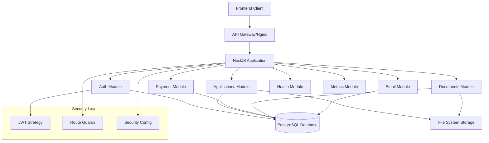
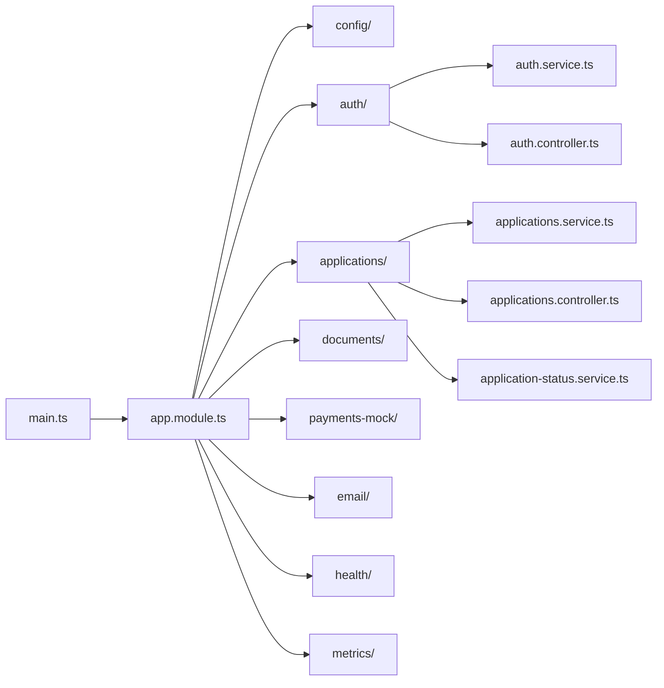
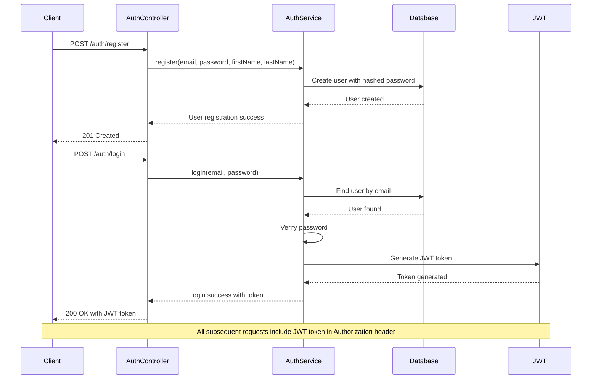
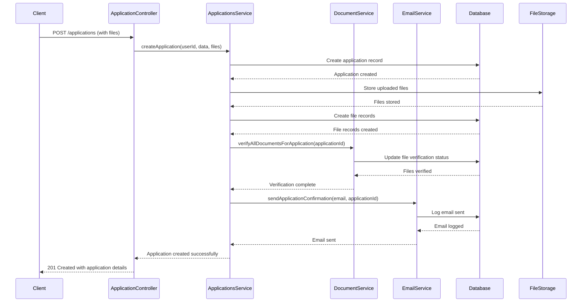
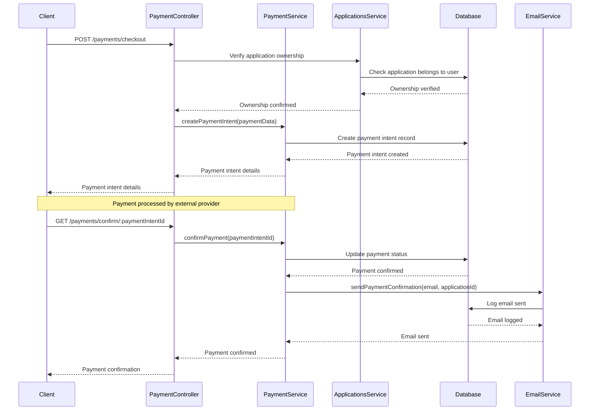
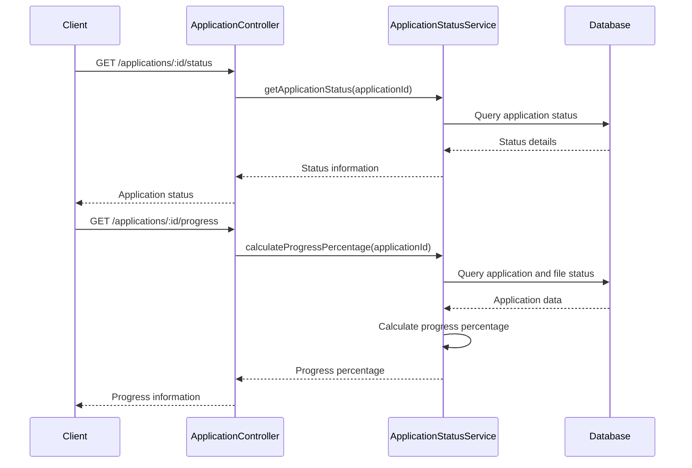
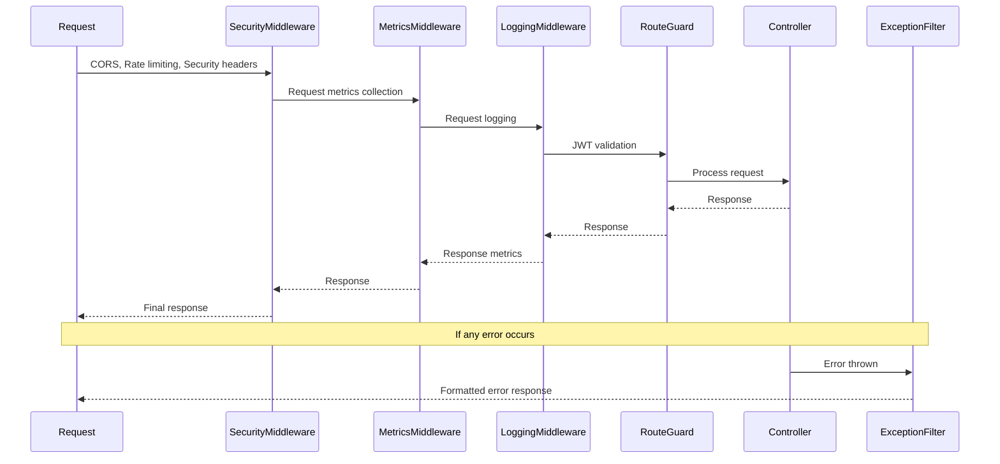
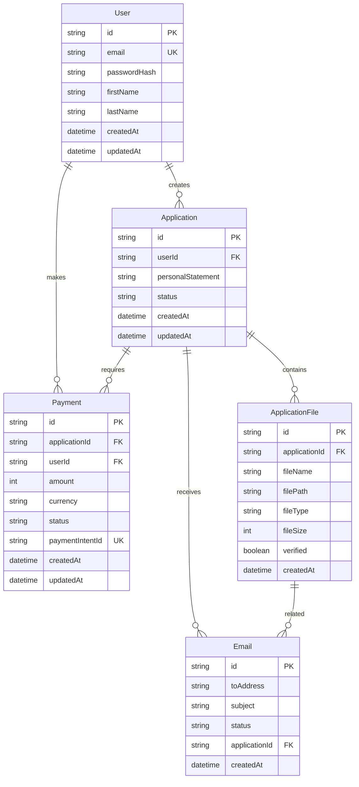

# University Admission Portal - System Architecture & Flow

## Overview

This document describes the system architecture and flow of the University Admission Portal backend, built with NestJS framework.

## System Architecture

## Module Structure

## Authentication Flow

## Application Submission Flow

## Payment Processing Flow

## Application Status Tracking Flow

## Middleware & Security Flow

## Database Schema Relationships

## Key Features & Components

### 1. Authentication & Authorization
- JWT-based authentication
- Password hashing with bcrypt
- Route guards for protected endpoints
- Token refresh mechanism

### 2. Application Management
- Multi-file upload support (up to 5 files)
- Document verification process
- Status tracking with progress calculation
- Personal statement support

### 3. Payment Processing
- Mock payment integration
- Payment intent creation and confirmation
- Webhook handling for payment events
- Payment status tracking

### 4. Communication
- Email notifications for application events
- Email logging in database
- Template-based email content

### 5. Monitoring & Health
- Metrics collection middleware
- Health check endpoints
- Request logging
- Exception handling filters

### 6. Security
- CORS configuration
- Rate limiting
- Input validation with class-validator
- SQL injection prevention with Prisma ORM

## API Endpoints Summary

### Authentication
- `POST /auth/register` - User registration
- `POST /auth/login` - User login
- `POST /auth/logout` - User logout
- `POST /auth/refresh` - Token refresh
- `GET /auth/profile` - Get user profile

### Applications
- `POST /applications` - Create application with files
- `GET /applications` - Get user applications
- `GET /applications/:id` - Get specific application
- `GET /applications/:id/status` - Get application status
- `GET /applications/:id/progress` - Get application progress
- `GET /applications/:applicationId/files/:fileId` - Download application file

### Payments
- `POST /payments/checkout` - Create payment intent
- `GET /payments/confirm/:paymentIntentId` - Confirm payment
- `GET /payments/:paymentIntentId/status` - Get payment status
- `POST /payments/webhook` - Handle payment webhooks

### Health & Monitoring
- `GET /health` - Health check
- `GET /metrics` - Application metrics

## Technology Stack

- **Framework**: NestJS
- **Database**: PostgreSQL with Prisma ORM
- **Authentication**: JWT
- **File Storage**: Local file system
- **Email**: Nodemailer (mock configuration)
- **Validation**: class-validator
- **Documentation**: Swagger/OpenAPI
- **Security**: Helmet, CORS, Rate limiting
- **Monitoring**: Custom metrics collection