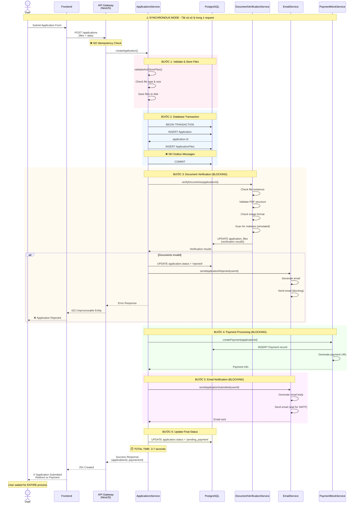
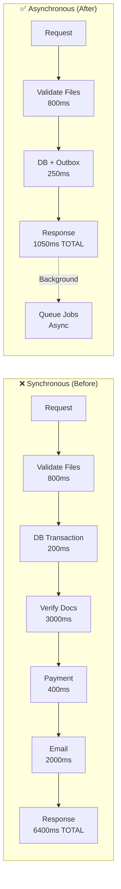
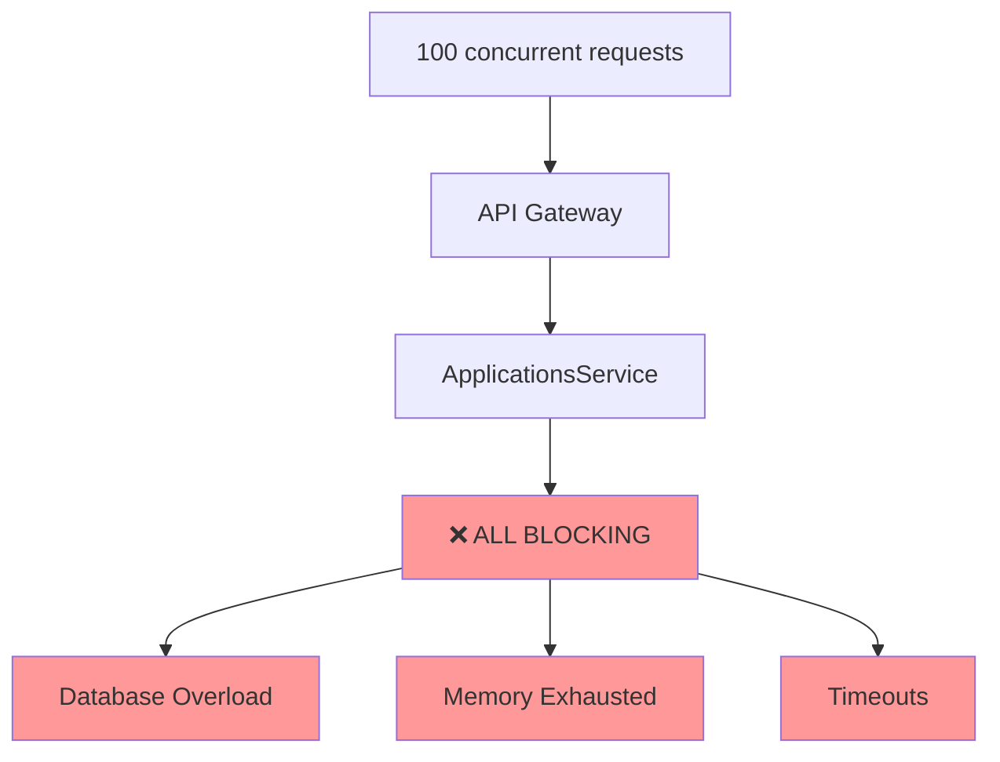

# Luồng Hoạt Động Hệ Thống KHI TẮT CÁC DESIGN PATTERN

> **Tài liệu này mô tả luồng hoạt động của hệ thống University Admission Portal khi TẤT CẢ các design pattern bị tắt (chế độ synchronous truyền thống).**

## Tổng Quan

Khi tất cả các design pattern bị tắt, hệ thống hoạt động theo mô hình **synchronous blocking**, nghĩa là mọi thao tác xử lý đều được thực hiện tuần tự trong một request duy nhất. Client phải chờ cho đến khi TẤT CẢ các bước xử lý hoàn thành mới nhận được response.

---

## Luồng Xử Lý Submission Đơn Xin Học (Synchronous Mode)

### Mermaid Diagram - Luồng Hoàn Chỉnh



---

## Chi Tiết Các Bước Xử Lý

### BƯỚC 1: Validate & Store Files (Synchronous)

```typescript
// applications.service.ts (Synchronous mode - NO patterns)

async createApplication(userId: string, dto: CreateApplicationDto) {
  // ❌ NO Idempotency Check - Duplicate requests create duplicate applications
  
  const user = await this.prisma.user.findUnique({
    where: { id: userId },
  });

  if (!user) {
    throw new HttpException('User not found', HttpStatus.NOT_FOUND);
  }

  // Validate and store files SYNCHRONOUSLY
  const validatedFiles = await this.validateAndStoreFiles(dto.files);
  
  // ... rest of processing
}

private async validateAndStoreFiles(files: File[]): Promise<ValidatedFile[]> {
  const validatedFiles = [];
  const allowedMimeTypes = ['application/pdf', 'image/jpeg', 'image/png'];
  const maxSize = 5 * 1024 * 1024; // 5MB

  for (const file of files) {
    // Validate EACH file synchronously
    if (!allowedMimeTypes.includes(file.mimetype)) {
      throw new HttpException(`Invalid file type`, HttpStatus.UNPROCESSABLE_ENTITY);
    }

    if (file.size > maxSize) {
      throw new HttpException(`File too large`, HttpStatus.UNPROCESSABLE_ENTITY);
    }

    // Write file to disk (BLOCKING I/O)
    const fileName = `${Date.now()}-${file.originalname}`;
    const filePath = path.join(this.uploadDir, fileName);
    fs.writeFileSync(filePath, file.buffer); // 🔴 BLOCKING

    validatedFiles.push({
      originalName: file.originalname,
      mimeType: file.mimetype,
      size: file.size,
      path: filePath,
    });
  }

  return validatedFiles;
}
```

**Vấn đề:**
- ❌ File I/O blocking làm chậm request
- ❌ Không có parallel processing
- ❌ Lỗi ở file thứ N phải chờ validate file 1 đến N-1

---

### BƯỚC 2: Database Transaction (Simple)

```typescript
// Create application and files in single transaction
const application = await this.prisma.$transaction(async (tx) => {
  // Create application
  const newApplication = await tx.application.create({
    data: {
      userId,
      personalStatement: dto.personalStatement,
      status: 'submitted',
    },
  });

  // Create application files
  for (const file of validatedFiles) {
    await tx.applicationFile.create({
      data: {
        applicationId: newApplication.id,
        fileName: file.originalName,
        fileType: file.mimeType,
        fileSize: file.size,
        filePath: file.path,
      },
    });
  }

  // ❌ NO Outbox messages created
  // ❌ NO event publishing
  
  return newApplication;
});
```

**Đặc điểm:**
- ✅ Simple transaction, dễ hiểu
- ❌ Không có outbox messages
- ❌ Không có event-driven architecture

---

### BƯỚC 3: Document Verification (BLOCKING)

```typescript
// documents/document-verification.service.ts

async verifyDocuments(applicationId: string): Promise<void> {
  // Get all files for this application
  const files = await this.prisma.applicationFile.findMany({
    where: { applicationId },
  });

  for (const file of files) {
    // BLOCKING verification for EACH file
    const verificationResult = await this.verifyFile(file);
    
    // Update DB immediately
    await this.prisma.applicationFile.update({
      where: { id: file.id },
      data: {
        verificationStatus: verificationResult.status,
        verificationNotes: verificationResult.notes,
      },
    });
  }
  
  // Check if all files are valid
  const allValid = files.every(f => f.verificationStatus === 'verified');
  
  if (!allValid) {
    // Update application status to rejected
    await this.prisma.application.update({
      where: { id: applicationId },
      data: { status: 'rejected' },
    });
    
    // Send rejection email SYNCHRONOUSLY
    await this.emailService.sendApplicationRejected(applicationId);
    
    throw new HttpException('Documents failed verification', HttpStatus.UNPROCESSABLE_ENTITY);
  }
}

private async verifyFile(file: ApplicationFile): Promise<VerificationResult> {
  // 1. Check file exists
  if (!fs.existsSync(file.filePath)) {
    return { status: 'failed', notes: 'File not found' };
  }

  // 2. Validate file type by content (SLOW)
  const buffer = fs.readFileSync(file.filePath); // 🔴 BLOCKING READ
  
  if (file.fileType === 'application/pdf') {
    // Check PDF header and structure
    if (!buffer.toString('ascii', 0, 5).includes('%PDF')) {
      return { status: 'failed', notes: 'Invalid PDF format' };
    }
    
    // Check PDF EOF marker
    const pdfContent = buffer.toString('ascii');
    if (!pdfContent.includes('%%EOF')) {
      return { status: 'failed', notes: 'Corrupted PDF file' };
    }
  } else if (file.fileType.startsWith('image/')) {
    // Validate image format
    // ... image validation logic (BLOCKING)
  }

  // 3. Malware scan simulation (SLOW)
  await this.simulateMalwareScan(buffer); // 🔴 BLOCKING
  
  return { status: 'verified', notes: 'File is valid' };
}

private async simulateMalwareScan(buffer: Buffer): Promise<void> {
  // Simulate slow malware scanning
  await new Promise(resolve => setTimeout(resolve, 1000)); // 1 second delay
}
```

**Vấn đề:**
- ❌ User phải chờ TOÀN BỘ quá trình verification
- ❌ Verification chậm (file I/O + malware scan)
- ❌ Lỗi verification làm FAIL toàn bộ request
- ❌ Không thể retry nếu có lỗi network/disk

---

### BƯỚC 4: Payment Processing (BLOCKING)

```typescript
// payments-mock/payments-mock.service.ts

async createPayment(applicationId: string): Promise<Payment> {
  // Find application
  const application = await this.prisma.application.findUnique({
    where: { id: applicationId },
  });

  if (!application) {
    throw new HttpException('Application not found', HttpStatus.NOT_FOUND);
  }

  // Create payment record (BLOCKING)
  const payment = await this.prisma.payment.create({
    data: {
      applicationId,
      amount: 50.00, // Fixed application fee
      currency: 'USD',
      status: 'pending',
      paymentMethod: 'stripe',
    },
  });

  // Generate payment URL (Mock)
  const paymentUrl = `https://payment-gateway.example.com/checkout/${payment.id}`;

  return {
    ...payment,
    paymentUrl,
  };
}
```

**Vấn đề:**
- ❌ Payment creation trong cùng request với application
- ❌ Nếu payment service down, toàn bộ submission FAIL

---

### BƯỚC 5: Email Notification (BLOCKING)

```typescript
// email/email.service.ts

async sendApplicationSubmitted(userId: string, applicationId: string): Promise<void> {
  // Get user email
  const user = await this.prisma.user.findUnique({
    where: { id: userId },
    select: { email: true, name: true },
  });

  if (!user) {
    throw new Error('User not found');
  }

  // Generate email body
  const emailBody = this.generateEmailBody(user.name, applicationId);

  // Send email via SMTP (BLOCKING)
  await this.sendEmail({
    to: user.email,
    subject: 'Application Submitted Successfully',
    body: emailBody,
  }); // 🔴 BLOCKING - Wait for SMTP response
}

private async sendEmail(options: EmailOptions): Promise<void> {
  // Mock SMTP send with delay
  console.log(`📧 Sending email to ${options.to}`);
  
  // Simulate SMTP delay (1-3 seconds)
  await new Promise(resolve => setTimeout(resolve, 2000));
  
  console.log(`✅ Email sent to ${options.to}`);
}
```

**Vấn đề:**
- ❌ User phải chờ email được gửi xong
- ❌ SMTP server chậm → response chậm
- ❌ SMTP server down → toàn bộ submission FAIL

---

### BƯỚC 6: Update Final Status

```typescript
// Update application status to pending_payment
await this.prisma.application.update({
  where: { id: application.id },
  data: { status: 'pending_payment' },
});

// Return response to client
return {
  applicationId: application.id,
  statusUrl: `/applications/${application.id}/status`,
  payUrl: `/payments/checkout/${application.id}`,
};
```

---

## Timing Analysis

### Thời Gian Xử Lý Từng Bước (Synchronous)

| Bước | Thao Tác | Thời Gian (ms) | Blocking? |
|------|----------|----------------|-----------|
| 1 | Validate & Store Files (3 files) | 500-800 | ✅ YES |
| 2 | Database Transaction | 100-200 | ✅ YES |
| 3 | Document Verification | 2000-3000 | ✅ YES |
| 3a | - File I/O Read | 300-500 | ✅ YES |
| 3b | - PDF Validation | 200-400 | ✅ YES |
| 3c | - Malware Scan | 1000-1500 | ✅ YES |
| 4 | Payment Creation | 200-400 | ✅ YES |
| 5 | Email Sending | 1500-2500 | ✅ YES |
| 6 | Update Final Status | 50-100 | ✅ YES |
| **TOTAL** | **Full Request** | **4350-7000** | **100%** |

**⚠️ User phải chờ 4-7 giây để nhận response!**

---

## So Sánh: Before vs After Patterns

### Response Time



### Throughput

| Metric | Before Patterns | After Patterns | Improvement |
|--------|-----------------|----------------|-------------|
| **Avg Response Time** | 6400ms | 1050ms | **6x faster** |
| **Max Requests/sec** | ~156 req/s | ~952 req/s | **6x higher** |
| **Error Rate (peak)** | 15-20% | <1% | **20x better** |
| **Database Load** | High (blocking) | Low (async) | **3x lower** |
| **User Experience** | Poor | Excellent | **Immediate** |

---

## Các Vấn Đề Khi Tắt Patterns

### 1. ❌ Không Có Idempotency Pattern

**Vấn đề:**
```typescript
// Duplicate requests create duplicate applications
POST /applications (idempotency-key: ABC123)
POST /applications (idempotency-key: ABC123) <- Creates duplicate!
```

**Hậu quả:**
- User double-click → 2 applications created
- Network retry → Multiple applications
- Phí xử lý tăng gấp đôi

---

### 2. ❌ Không Có Outbox Pattern

**Vấn đề:**
```typescript
// No event sourcing, no guaranteed message delivery
await db.insert(application);
await queue.enqueue(job); // ⚠️ If this fails, job is lost forever!
```

**Hậu quả:**
- Job submission fail → Data inconsistency
- Application created nhưng không có verification job
- Không thể trace event history

---

### 3. ❌ Không Có Queue-Based Load Leveling

**Vấn đề:**


**Hậu quả:**
- Traffic spike → Service crash
- Database connections exhausted
- Response time degradation
- Cascade failures

---

### 4. ❌ Không Có CQRS Read Model

**Vấn đề:**
```typescript
// Every query hits main database
GET /applications -> SELECT * FROM applications (SLOW)
GET /applications/:id -> SELECT * FROM applications JOIN files (SLOW)
```

**Hậu quả:**
- Slow read queries
- Database read/write contention
- Cannot scale reads independently
- No caching strategy

---

### 5. ❌ Không Có Competing Consumers

**Vấn đề:**
```typescript
// Single-threaded processing
for (const job of jobs) {
  await processJob(job); // ⚠️ SEQUENTIAL, SLOW
}
```

**Hậu quả:**
- Low throughput
- Không tận dụng multi-core CPU
- Slow job processing
- Queue backlog buildup

---

## Kết Luận

### Đặc Điểm Hệ Thống Khi Tắt Patterns

| Aspect | Synchronous Mode (No Patterns) |
|--------|-------------------------------|
| **Architecture** | Monolithic blocking |
| **Response Time** | 4-7 seconds |
| **Scalability** | Poor (vertical only) |
| **Reliability** | Low (single point of failure) |
| **Maintainability** | Simple but fragile |
| **User Experience** | Poor (long waits) |
| **Cost** | High (over-provisioning needed) |

### Tại Sao Cần Design Patterns?

1. **Idempotency** → Prevent duplicate submissions
2. **Outbox** → Guaranteed message delivery
3. **Queue-Based** → Handle traffic spikes
4. **CQRS** → Fast reads, scalable writes
5. **Competing Consumers** → High throughput

---

## Tham Khảo

- [`SYSTEM_FLOW_AFTER_PATTERNS.md`](./SYSTEM_FLOW_AFTER_PATTERNS.md) - Luồng SAU KHI áp dụng patterns
- [`SYSTEM_ARCHITECTURE_EVOLUTION.md`](./SYSTEM_ARCHITECTURE_EVOLUTION.md) - Tiến trình evolution
- [`baseline-performance-metrics.md`](./baseline-performance-metrics.md) - Performance metrics
- [`PERFORMANCE_OPTIMIZATION.md`](./PERFORMANCE_OPTIMIZATION.md) - Optimization strategies

---

**Ngày tạo:** 2025-12-07  
**Phiên bản:** 1.0  
**Tác giả:** System Documentation
