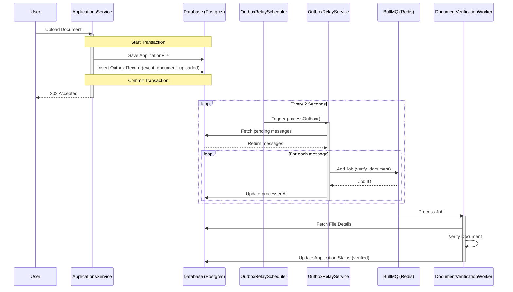
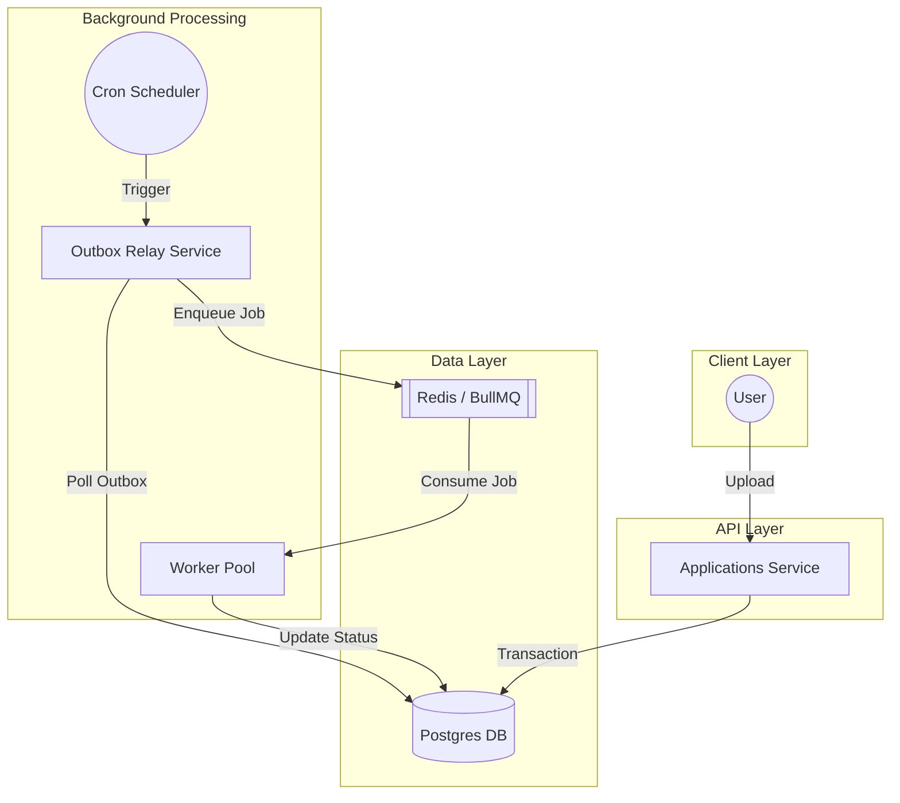

# Queue-Based Load Leveling & Outbox Pattern Implementation

This document provides a detailed technical overview of how the **Queue-Based Load Leveling** and **Outbox Pattern** are implemented in the University Admission Portal codebase. These patterns are critical for handling high traffic loads (up to 3,000 RPS) and ensuring data consistency.

## 1. Queue-Based Load Leveling

The Queue-Based Load Leveling pattern decouples the submission of tasks from their processing. This allows the system to accept requests at a high rate and process them asynchronously at a controlled pace, preventing system overload.

### 1.1 Core Components

The implementation relies on **BullMQ** (a Node.js message queue library based on Redis) and is structured around the following components:

#### **Queue Producer Service**
- **File**: `backend/src/feature-flags/queue/queue-producer.service.ts`
- **Responsibility**: Adds jobs to the appropriate queues with specific priorities.
- **Queues**:
  - `verify_document`: For document verification tasks.
  - `create_payment`: For payment processing tasks.
  - `send_email`: For sending notifications.
- **Priorities**:
  - `critical` (0)
  - `high` (1)
  - `normal` (2)
  - `low` (3)

#### **Worker Pool Service**
- **File**: `backend/src/feature-flags/workers/worker-pool.service.ts`
- **Responsibility**: Manages the worker pools, including configuration, health monitoring, and statistics.
- **Features**:
  - **Concurrency Control**: Defines how many jobs each worker can process simultaneously (e.g., 3 for document verification, 5 for payments).
  - **Health Monitoring**: Periodically checks queue depth, error rates, and stalled jobs.
  - **Dynamic Scaling**: Can enable/disable pools or adjust configuration at runtime (via feature flags).

#### **Workers**
- **Base Class**: `WorkerBase` (`backend/src/feature-flags/workers/worker-base.ts`)
  - Handles common logic like error logging, retries, and updating application status/progress.
- **Implementations**:
  - `DocumentVerificationWorker`: Processes `verify_document` queue. Verifies files and updates status to `verified` or `verification_failed`.
  - `PaymentProcessingWorker`: Processes `create_payment` queue.
  - `EmailSendingWorker`: Processes `send_email` queue.

### 1.2 Workflow

1.  **Job Enqueueing**: A service (typically the Outbox Relay) calls `QueueProducerService` to add a job.
2.  **Buffering**: Jobs are stored in Redis.
3.  **Processing**: Workers pick up jobs based on priority and availability.
4.  **Status Update**: Workers update the `Application` status in the database (e.g., `verifying` -> `verified`).

---

## 2. Outbox Pattern

The Outbox Pattern ensures reliable message publishing by persisting events to a database table within the same transaction as the business data. This guarantees that no events are lost even if the message broker is temporarily unavailable.

### 2.1 Core Components

#### **Database Schema**
- **Table**: `Outbox`
- **Columns**:
  - `id`: Unique identifier.
  - `eventType`: Type of event (e.g., `document_uploaded`, `application_submitted`).
  - `payload`: JSON string containing event data.
  - `processedAt`: Timestamp (null if pending).
  - `createdAt`: Timestamp.

#### **Outbox Relay Service**
- **File**: `backend/src/feature-flags/outbox/outbox-relay.service.ts`
- **Responsibility**: Reads pending messages from the `Outbox` table and publishes them to the queue.
- **Logic**:
  - Fetches up to 100 messages where `processedAt` is null.
  - Iterates through messages and calls `QueueProducerService` based on `eventType`.
  - Updates `processedAt` to the current timestamp upon successful enqueueing.

#### **Outbox Relay Scheduler**
- **File**: `backend/src/feature-flags/outbox/outbox-relay.scheduler.ts`
- **Responsibility**: Triggers the relay process.
- **Schedule**: Runs every **2 seconds** (`@Cron('*/2 * * * * *')`) and on module initialization.

### 2.2 Workflow

1.  **Transaction Start**: A user action (e.g., uploading a document) initiates a database transaction.
2.  **Data Persistence**:
    - The application data (e.g., `ApplicationFile` record) is saved.
    - An `Outbox` record (event: `document_uploaded`) is created **in the same transaction**.
3.  **Commit**: The transaction is committed. If this fails, neither the data nor the event is saved.
4.  **Relay**:
    - The `OutboxRelayScheduler` triggers.
    - `OutboxRelayService` picks up the new event.
    - The event is pushed to the `verify_document` queue.
    - The `Outbox` record is marked as processed.
5.  **Consumption**: The `DocumentVerificationWorker` picks up the job and processes it.

---

## 3. End-to-End Example: Document Upload

1.  **User Action**: User uploads a transcript.
2.  **API Layer**: `ApplicationsService` handles the request.
3.  **Database Transaction**:
    - Saves `ApplicationFile` (path, type, etc.).
    - Creates `Outbox` entry: `{ eventType: 'document_uploaded', payload: { applicationId: '...', fileIds: [...] } }`.
4.  **Response**: API returns 202 Accepted immediately.
5.  **Async Processing**:
    - **T+2s**: `OutboxRelayService` reads the event.
    - **Enqueue**: Calls `QueueProducerService.addVerifyDocumentJob()`.
    - **Worker**: `DocumentVerificationWorker` receives the job.
    - **Execution**: Worker verifies the file content.
    - **Completion**: Worker updates Application status to `verified`.

### 3.1 Flow Diagram

### 3.2 Component Architecture

## 4. Key Files Summary

| Component | File Path |
|-----------|-----------|
| **Producer** | `backend/src/feature-flags/queue/queue-producer.service.ts` |
| **Worker Manager** | `backend/src/feature-flags/workers/worker-pool.service.ts` |
| **Worker Base** | `backend/src/feature-flags/workers/worker-base.ts` |
| **Doc Worker** | `backend/src/feature-flags/workers/document-verification.worker.ts` |
| **Outbox Relay** | `backend/src/feature-flags/outbox/outbox-relay.service.ts` |
| **Scheduler** | `backend/src/feature-flags/outbox/outbox-relay.scheduler.ts` |
